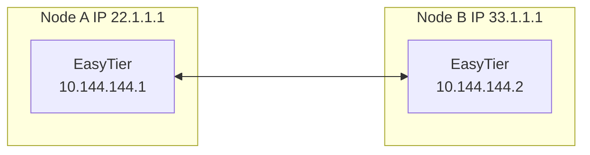
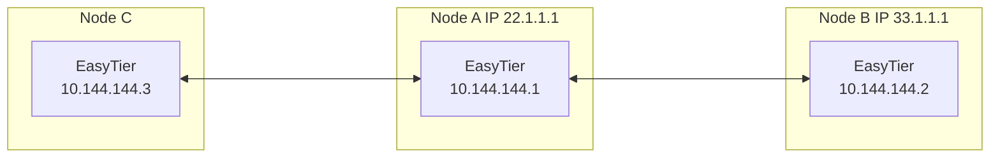

# Decentralized Networking

Most networking software is centralized, where all devices must connect to a central server to form a network.

EasyTier is decentralized, with no distinction between server and client. As long as one device can communicate with any node in the virtual network, it can join the virtual network.

## Two-Node Networking

Assume the network topology of two nodes is as follows:



1. Execute on Node A:

   ```sh
   sudo easytier-core -i 10.144.144.1
   ```

2. Execute on Node B:

   ```sh
   sudo easytier-core -d -p udp://22.1.1.1:11010
   ```

   Here, `-d` represents DHCP mode, and EasyTier will automatically obtain an IP address.

## Three-Node Networking

Based on the previous two-node networking example, the third node C can join the virtual network by connecting to either Node A or Node B.

Assume it connects to Node A, the network topology is as follows:



Execute on Node C:

```sh
sudo easytier-core -d -p udp://22.1.1.1:11010
```

Then C can communicate with A and B through the virtual network.
