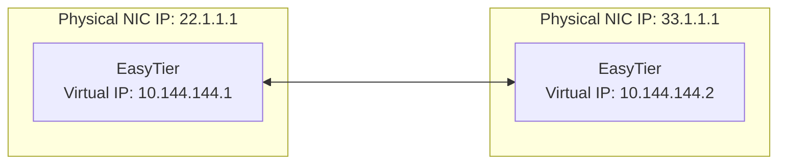
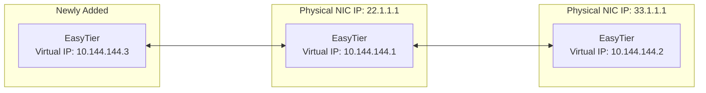

# Decentralized Networking

Most networking software is centralized, where all devices must connect to a central server to form a network.

EasyTier is decentralized, with no distinction between server and client. As long as one device can communicate with any node in the virtual network, it can join the virtual network.

## Two-Node Networking {#two-nodes}

Assume the network topology of two nodes is as follows:



### Steps

1. Run the following command on Node A:

   ```sh
   sudo easytier-core -i 10.144.144.1
   ```

   - `-i` specifies the virtual network IP address.

   After startup, this node will listen on the following ports by default:

   | Protocol      | Default Port |
   | ------------- | ------------ |
   | TCP           | 11010 (TCP)  |
   | UDP           | 11010 (UDP)  |
   | WebSocket     | 11011 (TCP)  |
   | WebSocket SSL | 11012 (TCP)  |
   | WireGuard     | 11011 (UDP)  |
   | QUIC          | 11012 (UDP)  |
   | FakeTCP       | 11013        |

   You can specify listening ports through the `-l` parameter, for example:

   | Parameter Example           | Description                                                                                                                                             |
   | --------------------------- | ------------------------------------------------------------------------------------------------------------------------------------------------------- |
   | `-l 12345`                  | Change the base port to 12345, then listening ports are: TCP: 12345, UDP: 12345, WebSocket: 12346, WebSocket SSL: 12347, WireGuard: 12348               |
   | `-l tcp:11010 -l udp:11011` | Change TCP port to 11010, UDP port to 11011, only listen on these two ports. Supported protocols are `tcp`, `udp`, `ws`, `wss`, `wg`, `quic`, `faketcp` |
   | `--no-listener`             | Disable port listening, which will affect the establishment of non-hole-punching connections.                                                           |

2. Run the following command on Node B:

   ```sh
   sudo easytier-core -d -p udp://22.1.1.1:11010
   ```

   - `-d` represents DHCP mode, automatically assign virtual IP.
   - `-p` specifies the public address and port of Node A.

## Three-Node Networking

Based on two-node networking, the third node C can join the virtual network by connecting to Node A or Node B.

Assume networking by connecting to Node A, the network topology is as follows:



### Steps

1. Run the following command on Node C:

   ```sh
   sudo easytier-core -d -p udp://22.1.1.1:11010
   ```

   - `-d` represents DHCP mode, automatically assign virtual IP.
   - `-p` specifies the public address and port of Node A.

Subsequently, Node C can communicate with Node A and Node B through the virtual network.
