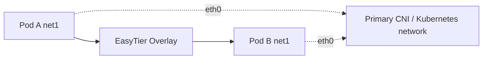

# EasyTier CNI (Kubernetes)

EasyTier CNI uses Multus to attach an EasyTier TUN as a secondary Pod interface. The existing primary CNI interface continues to provide Kubernetes Services, DNS, and the EasyTier underlay. Only traffic for the secondary virtual subnet uses EasyTier.



::: warning Current scope
The initial release supports CNI `1.0.0`, one IPv4 address, and a standalone Multus delegate. It does not change the Pod default route or DNS and does not support a primary CNI, IPv6, or chained `prevResult`.
:::

## Prerequisites

- Linux Kubernetes nodes with `/dev/net/tun`.
- [Multus CNI](https://github.com/k8snetworkplumbingwg/multus-cni).
- [Whereabouts](https://github.com/k8snetworkplumbingwg/whereabouts), or another IPAM plugin that returns one IPv4 address and no extra routes.
- At least one EasyTier peer reachable through every Pod's primary network.
- An EasyTier image containing both `easytier-core` and `easytier-cni`.

## Coexisting with Flannel

EasyTier CNI does not replace or modify Flannel. Flannel continues to provide the Pod's primary `eth0` interface, while Multus invokes EasyTier for the secondary `net1` interface.

An existing Flannel cluster does not need Flannel reinstalled. For a deployment created from the upstream Flannel manifest, use these commands to confirm that Flannel and all nodes are healthy. Use the actual namespace and DaemonSet name for distribution-managed or Helm deployments:

```sh
kubectl -n kube-flannel rollout status daemonset/kube-flannel-ds --timeout=5m
kubectl wait node --all --for=condition=Ready --timeout=5m
```

Flannel still requires standard CNI plugins such as `bridge`, `host-local`, and `portmap`, together with the `br_netfilter` kernel module. EasyTier CNI does not install these Flannel prerequisites.

After the primary network is healthy, install Multus, Whereabouts, and EasyTier CNI in that order. For a new cluster, [install Flannel](https://github.com/flannel-io/flannel#deploying-flannel-manually) and wait for the nodes to become Ready first. Multus auto-configuration selects the existing Flannel configuration as its default network; for a manual Multus configuration, set Flannel as the default delegate. Do not add EasyTier to the Flannel conflist. Attach EasyTier only through the `NetworkAttachmentDefinition` created later in this guide.

When Flannel uses its default `10.244.0.0/16`, the example EasyTier range `10.200.0.0/24` can be used, provided it does not overlap any other network in the environment.

::: tip Validated combination
The three-node Kind test disables the default kindnet and uses Flannel `v0.28.9` as the only primary CNI, with Multus `v4.3.0` and Whereabouts `v0.9.4`. It verifies cross-node `net1` ping and HTTP between Pods on different workers, Service/DNS access through the Flannel primary network, MTU, deletion, and IPAM address release.
:::

::: warning Security
The node DaemonSet must enter Pod network namespaces and create TUN devices, so it uses privileged mode, hostPID, and the host `/run`. Pin production deployments to an EasyTier release that contains CNI support. Do not deploy a mutable `unstable` tag in production.
:::

## 1. Create the network secret

Do not put the EasyTier network secret in a `NetworkAttachmentDefinition`:

```sh
kubectl -n kube-system create secret generic easytier-cni \
  --from-literal=network-secret="$EASYTIER_NETWORK_SECRET"
```

The DaemonSet installs the secret as a root-only node file. Management RPC uses a root-only Unix socket on the node and does not expose a TCP management port.

## 2. Deploy the node DaemonSet

Download the [official DaemonSet manifest](https://github.com/EasyTier/EasyTier/blob/main/easytier-contrib/easytier-cni/deploy/daemonset.yaml), pin both EasyTier image references to the same release, and deploy it:

```sh
kubectl apply -f daemonset.yaml
kubectl -n kube-system rollout status daemonset/easytier-cni
```

Confirm that the plugin and management process are running on every node:

```sh
kubectl -n kube-system get pods -l app.kubernetes.io/name=easytier-cni -o wide
```

## 3. Create the secondary network

Start with the [official NAD example](https://github.com/EasyTier/EasyTier/blob/main/easytier-contrib/easytier-cni/deploy/network-attachment-definition.yaml):

```json
{
  "cniVersion": "1.0.0",
  "name": "easytier",
  "type": "easytier-cni",
  "rpcPortal": "unix:///run/easytier-cni/rpc.sock",
  "networkName": "kubernetes",
  "networkSecretFile": "/etc/easytier-cni/network-secret",
  "peers": ["tcp://192.0.2.10:11010"],
  "mtu": 1380,
  "timeoutSeconds": 30,
  "ipam": {
    "type": "whereabouts",
    "range": "10.200.0.0/24",
    "range_start": "10.200.0.10",
    "range_end": "10.200.0.250"
  }
}
```

- `peers` must be reachable through the Pod's primary interface. Prefer IP addresses so CNI setup does not depend on cluster DNS.
- The EasyTier range must not overlap node, Pod, Service, LAN, VPN, or container-runtime networks.
- `mtu` is the EasyTier packet MTU. The TUN MTU excludes protocol overhead; for example, `1380` produces a TUN MTU of `1360`.

Apply the completed NAD:

```sh
kubectl apply -f network-attachment-definition.yaml
```

## 4. Attach EasyTier to a Pod

Add a Multus annotation to the Pod:

```yaml
apiVersion: v1
kind: Pod
metadata:
  name: easytier-client
  annotations:
    k8s.v1.cni.cncf.io/networks: easytier
spec:
  containers:
    - name: client
      image: busybox:1.37.0
      command: ["/bin/sh", "-c", "sleep 3600"]
```

The default secondary interface name is `net1`. Inspect its address and the Multus network status:

```sh
kubectl exec easytier-client -- ip address show net1
kubectl get pod easytier-client \
  -o jsonpath='{.metadata.annotations.k8s\.v1\.cni\.cncf\.io/network-status}'
```

After two Pods join the same EasyTier network, they can communicate directly through their `net1` IPv4 addresses.

## Operations

- Deleting a Pod removes its EasyTier instance and releases its Whereabouts address.
- The node daemon persists attachments under `/var/lib/easytier-cni/configs`. This directory contains network credentials and must remain root-only.
- After updating the Secret, restart the `easytier-cni` DaemonSet and recreate Pods that use the EasyTier network.
- After uninstalling, remove `/etc/easytier-cni` and `/var/lib/easytier-cni` from nodes when appropriate.

Complete configuration, automated netns tests, and the three-node Kind test are available under [`easytier-contrib/easytier-cni`](https://github.com/EasyTier/EasyTier/tree/main/easytier-contrib/easytier-cni).
