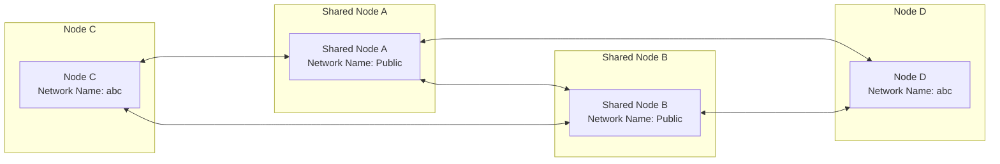
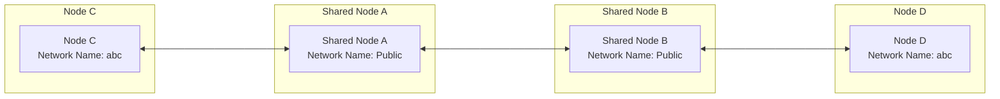

# Fast Networking

## Networking with Shared Nodes

When you don't have a public IP, you can use the free shared nodes provided by the EasyTier community to quickly set up a network. After successfully networking between nodes, NAT traversal will be attempted automatically to establish a P2P connection. Before successful P2P, the shared nodes will help forward data.

Assume there are two nodes A and B:

1. Execute on node A (please replace abc with a more complex network name to avoid connection failure due to network name conflict)

   ```sh
   sudo easytier-core -i 10.144.144.1 --network-name abc --network-secret abc -p tcp://public.easytier.cn:11010
   ```

   > `-i` specifies the virtual network IP address, default /24 subnet;
   >
   > `--network-name` and `--network-secret` represent the network name and network secret;
   >
   > `-p` specifies the node address, here using the official shared node.

2. Execute on node B

   ```sh
   sudo easytier-core -d --network-name abc --network-secret abc -p tcp://public.easytier.cn:11010
   ```

   > `-d` represents DHCP mode, EasyTier will automatically obtain an IP address.

3. Test connectivity

   The two nodes should successfully connect and be able to communicate within the virtual subnet. You can execute the following on node B to test.

   ```sh
   ping 10.144.144.1
   ```

::: warning Note
Some systems have firewalls enabled by default, which may block inbound traffic, causing the virtual IP to be unreachable or various services to be inaccessible. You need to manually disable the firewall or add rules.
:::

## Check Virtual Network Status

After starting easytier-core, you can use easytier-cli for management.

- View node information in the virtual network

```sh
easytier-cli peer
```

| ipv4         | hostname | cost | lat_ms | loss_rate | rx_bytes | tx_bytes | tunnel_proto | nat_type | id        |
| :----------- | :------- | :--- | :----- | :-------- | :------- | :------- | :----------- | :------- | :-------- |
| 10.144.144.1 | abc-dec  | 1    | 3.452  | 0         | 17.33kB  | 20.42kB  | udp          | FullCone | 390879727 |

- View virtual network routing information

```sh
easytier-cli route
```

| ipv4         | hostname | proxy_cidrs | next_hop_ipv4 | next_hop_hostname | next_hop_lat | cost |
| :----------- | :------- | :---------- | :------------ | :---------------- | :----------- | :--- |
| 10.144.144.1 | abc-dec  |             | DIRECT        |                   | 3.646        | 1    |

- View information of the local node

```sh
easytier-cli node
```

```
┌───────────────┬──────────────────────┐
│ Virtual IP    │ 10.144.144.1         │
├───────────────┼──────────────────────┤
│ Hostname      │ archlinux-base       │
├───────────────┼──────────────────────┤
│ Proxy CIDRs   │ 10.147.223.0/24      │
├───────────────┼──────────────────────┤
│ Peer ID       │ 2616333191           │
├───────────────┼──────────────────────┤
│ Public IP     │ 75.52.125.26         │
├───────────────┼──────────────────────┤
│ UDP Stun Type │ FullCone             │
├───────────────┼──────────────────────┤
│ Listener 1    │ tcp://0.0.0.0:11010  │
├───────────────┼──────────────────────┤
│ Listener 2    │ udp://0.0.0.0:11010  │
├───────────────┼──────────────────────┤
│ Listener 3    │ wg://0.0.0.0:11011   │
├───────────────┼──────────────────────┤
│ Listener 4    │ ws://0.0.0.0:11011/  │
├───────────────┼──────────────────────┤
│ Listener 5    │ wss://0.0.0.0:11012/ │
├───────────────┼──────────────────────┤
│ Listener 6    │ udp://[::]:37039     │
└───────────────┴──────────────────────┘
```

## Using Multiple Shared Nodes

To avoid virtual network unavailability due to a single shared node failure, you can connect to multiple shared nodes simultaneously. Just specify multiple `-p` parameters, such as: `-p tcp://1.1.1.1:11010 -p udp://1.1.1.2:11011`. Each node in the virtual network should specify the same list of public servers.

This relies on the shared node cluster feature supported by EasyTier. Assume there are two shared nodes A and B, which are interconnected to form a cluster. When C and D want to network, they can connect to both A and B simultaneously. This way, even if A or B fails, C and D can still communicate. The networking mode is shown in the diagram:



Even in the case of network partitioning, where C can only connect to A and D can only connect to B, C and D can still communicate.



## Joining Multiple Virtual Networks Simultaneously

EasyTier supports running multiple processes on the same device, each joining a different virtual network by using different parameters at startup. Note that the virtual IP subnets of multiple virtual networks should not overlap, otherwise routing conflicts will occur.

Additionally, when running multiple EasyTier instances, different listener ports need to be specified to avoid port conflicts.

For example, you can start two EasyTier processes with the following commands:

```sh
sudo easytier-core --network-name net1 -p tcp://public.easytier.cn:11010 -l 11010
sudo easytier-core --network-name net2 -p tcp://public.easytier.cn:11010 -l 21010
```

> `-l` specifies the listener port.
