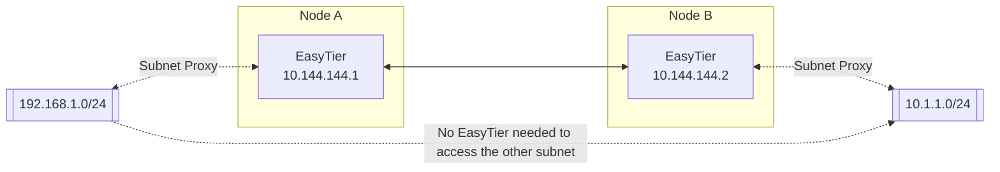

# Network to Network

The network topology of network to network is shown in the figure



After the network to network configuration is successful, devices in the 192.168.1.0/24 subnet can communicate with devices in the 10.1.1.0/24 subnet without installing EasyTier.

## Linux Network to Network Configuration

To achieve network to network, Node A needs to be the gateway for the 192.168.1.0/24 subnet. The startup and configuration parameters for the two EasyTier nodes are as follows:

Node A

```bash
# Start EasyTier and proxy the 192.168.1.0/24 subnet, using a public server to help network
easytier-core -i 10.144.144.1 -n 192.168.1.0/24 --network-name n2n_test

# Allow the gateway to forward traffic and configure the firewall to allow traffic forwarding
sysctl -w net.ipv4.ip_forward=1
iptables -A FORWARD -s 192.168.1.0/24 -j ACCEPT
iptables -A FORWARD -d 192.168.1.0/24 -j ACCEPT
```

Node B

```bash
# Start EasyTier and proxy the 10.1.1.0/24 subnet, using a public server to help network
easytier-core -i 10.144.144.2 -n 10.1.1.0/24 --network-name n2n_test
```
