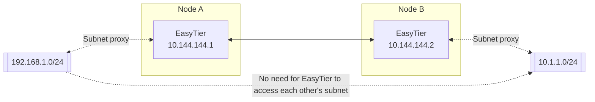

# Network-to-Network

The network topology of network-to-network is shown in the figure below.



After the network-to-network configuration is successful, devices in the 192.168.1.0/24 subnet can access devices in the 10.1.1.0/24 subnet for mutual communication without installing EasyTier.

To achieve network-to-network, Node A needs to be the gateway of the 192.168.1.0/24 subnet. The startup and configuration parameters for the two EasyTier nodes are as follows:

Node A
```bash
# Start EasyTier and proxy the 192.168.1.0/24 subnet, and use a public server to help network
easytier-core -i 10.144.144.1 -n 192.168.1.0/24 -p tcp://easytier.public.kkrainbow.top:11010 --network-name n2n_test

# Allow the gateway to forward traffic and configure the firewall to allow forwarding traffic
sysctl -w net.ipv4.ip_forward=1
iptables -A FORWARD -s 192.168.1.0/24 -j ACCEPT
iptables -A FORWARD -d 192.168.1.0/24 -j ACCEPT
```

Node B
```bash 
# Start EasyTier and proxy the 10.1.1.0/24 subnet, and use a public server to help network 
easytier-core -i 10.144.144.2 -n 10.1.1.0/24 -p tcp://easytier.public.kkrainbow.top:11010 --network-name n2n_test $ 
```