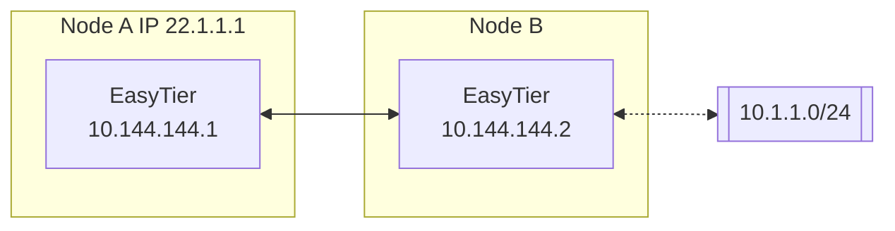

# Subnet Proxy (Point-to-Network)

Assuming the network topology is as follows, Node B wants to share its accessible subnet 10.1.1.0/24 with other nodes.



Then the startup parameters for Node B's easytier are (new -n parameter)

```sh
sudo easytier-core --ipv4 10.144.144.2 -n 10.1.1.0/24
```

Subnet proxy information will automatically sync to each node in the virtual network, and each node will automatically configure the corresponding route. Node A can check whether the subnet proxy is effective through the following command.

1. Check whether the routing information has beensynchronized, the proxy_cidrs column shows the proxied subnets.

   ```sh
   easytier-cli route
   ```

   | ipv4         | hostname | proxy_cidrs | next_hop_ipv4 | next_hop_hostname | next_hop_lat | cost |
   | :----------- | :------- | :---------- | :------------ | :---------------- | :----------- | :--- |
   | 10.144.144.1 | abc-dec  | 10.1.1.0/24 | DIRECT        |                   | 3.25         | 1    |

2. Test whether Node A can access nodes under the proxied subnet

   ```sh
   ping 10.1.1.2
   ```

## Manually Specifying Routes

By default, when a node in the virtual network is configured with a subnet proxy, the subnet proxy's segment is synchronized to all nodes within the virtual network, and a route is automatically generated to handle packets destined for these segments via the virtual network.

This simplifies networking in most cases, but in some scenarios, users may not want EasyTier to automatically configure routes on the node. Users can manually configure the traffic that needs to be forwarded to the virtual network using the `--manual-routes` parameter.

After using `--manual-routes`, only the segments configured with this parameter will enter the virtual network. If the list after this parameter is empty, EasyTier will not process any traffic for non-virtual network segments.

## Firewall

Since proxy traffic requires the use of the system's network stack, the subnet proxy needs to disable the firewall on the virtual network card (this applies to both Linux and Windows).

If it is not possible to disable the firewall, you can try using the user-space network stack for the subnet proxy, which can eliminate the need to configure the firewall. Simply add the `--use-smoltcp` parameter when starting EasyTier.

---
