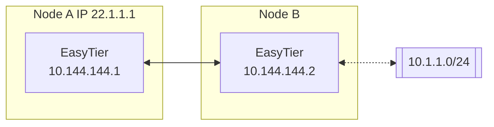

# Subnet Proxy (Point-to-Network)

Assume the network topology is as follows, and node B wants to share its accessible subnet 10.1.1.0/24 with other nodes.



The startup parameters for node B's easytier are as follows (add the -n parameter)

```sh
sudo easytier-core --ipv4 10.144.144.2 -n 10.1.1.0/24
```

The subnet proxy information will be automatically synchronized to each node in the virtual network, and each node will automatically configure the corresponding routes. Node A can check if the subnet proxy is effective with the following command.

1. Check if the routing information has been synchronized. The proxy_cidrs column shows the proxied subnets.

   ```sh
   easytier-cli route
   ```

   | ipv4         | hostname | proxy_cidrs | next_hop_ipv4 | next_hop_hostname | next_hop_lat | cost |
   | :----------- | :------- | :---------- | :------------ | :---------------- | :----------- | :--- |
   | 10.144.144.1 | abc-dec  | 10.1.1.0/24 | DIRECT        |                   | 3.25         | 1    |

2. Test if node A can access the nodes under the proxied subnet

   ```sh
   ping 10.1.1.2
   ```

::: warning Note
The -n parameter for subnet proxy can be specified multiple times to proxy multiple subnets; you can also set the mask to 32 to proxy a single IP address.

```sh
easytier-core -n 10.1.1.0/24 -n 10.2.0.0/16 -n 10.3.3.3/32
```

:::

## Firewall

Since proxy traffic needs to use the system's network stack, the subnet proxy requires the firewall on the virtual network card to be disabled.

- On Windows, you can add `easytier-core.exe` to the firewall exception list or directly disable the firewall.

- On Linux, you can use `iptables` or `ufw` to allow INPUT and OUTPUT traffic on the virtual network card.

- On OpenWrt, you can allow virtual network card traffic in the LUCI interface.

If you cannot disable the firewall, you can try using a user-space network stack for the subnet proxy, which can avoid the need to configure the firewall. Simply add the `--use-smoltcp` parameter when starting EasyTier.

::: warning Note

The user-space protocol stack will be inferior to the kernel protocol stack in terms of performance, congestion control, etc.

Currently, the `--use-smoltcp` parameter only affects the TCP protocol. UDP and ICMP will use the user-space protocol stack regardless of whether this parameter is used.

:::

## Manually Specifying Routes

By default, when a node in the virtual network configures a subnet proxy, the subnet proxy segment will be synchronized to all nodes in the virtual network, and a route will be automatically generated to forward packets destined for these segments to the virtual network.

This can simplify networking in most cases, but in some scenarios, users may not want EasyTier to automatically configure routes on the nodes. Users can manually configure the traffic to be forwarded to the virtual network using the `--manual-routes` parameter.

When using `--manual-routes`, only the segments configured with this parameter will enter the virtual network. If the list after this parameter is empty, EasyTier will not handle any traffic for non-virtual network segments. For example:

```sh
sudo easytier-core --ipv4 10.144.144.2 -n 10.1.1.0/24 --manual-routes 10.1.1.0/24
```

`--manual-routes` can be specified multiple times to configure multiple segments, with the same format as the `-n` parameter.

Then only traffic from the 10.1.1.0/24 segment will be handled by the virtual network on this node, and traffic from other segments will not enter the virtual network.

## Network Segment Mapping

Assume the following scenario: Both node A and node B have subnets of `192.168.1.0/24` in their internal networks (same network segment but different physical networks). If nodes A and B want to proxy this network segment, they need to map this network segment to different virtual network segments.

The following commands map `192.168.1.0/24` to `10.1.1.0/24` on node A, and `192.168.1.0/24` to `10.2.2.0/24` on node B.

```sh
# Run on node A
sudo easytier-core --ipv4 10.144.144.1 -n '192.168.1.0/24->10.1.1.0/24'

# Run on node B
sudo easytier-core --ipv4 10.144.144.2 -n '192.168.1.0/24->10.2.2.0/24'
```

Other nodes in the virtual network can access the `192.168.1.X` proxied by node A by accessing `10.1.1.X`; and access the `192.168.1.X` proxied by node B by accessing `10.2.2.X`.

::: warning Note
The mapped network segment size must be the same as the original network segment size, otherwise EasyTier will fail to start.
:::

## Disabling Built-in NAT

By default, the built-in NAT is enabled in the subnet proxy, which handles packet forwarding in user space. This allows non-gateway devices to act as subnet entry points while circumventing the limitations on packet forwarding across different operating systems.

If Easytier is operating on a gateway device, users can use the `--proxy-forward-by-system` parameter to delegate the forwarding of subnet proxy packets to the system kernel, in which case the built-in NAT will be disabled.

It is important to note that when this option is enabled, the packet forwarding of the subnet proxy will rely entirely on the operating system. Therefore, please ensure that the operating system's firewall, forwarding rules, routing rules, and other configurations are correctly set up.

## Network to Network

The mutual access between the subnet under node A and the subnet under node B is called network to network. For network to network configuration, please refer to the [Network to Network](network-to-network) chapter.

---
