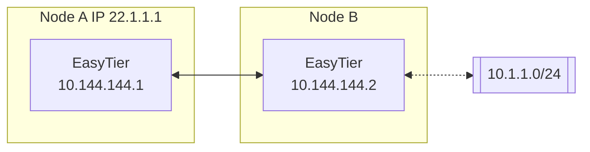

# Subnet Proxy (Point-to-Network)

Assuming the network topology is as follows, Node B wants to share its accessible subnet 10.1.1.0/24 with other nodes.



Then the startup parameters for Node B's easytier are (new -n parameter)

```sh
sudo easytier-core --ipv4 10.144.144.2 -n 10.1.1.0/24
```

Subnet proxy information will automatically sync to each node in the virtual network, and each node will automatically configure the corresponding route. Node A can check whether the subnet proxy is effective through the following command.

1. Check whether the routing information has beensynchronized, the proxy_cidrs column shows the proxied subnets.

   ```sh
   easytier-cli route
   ```
   

2. Test whether Node A can access nodes under the proxied subnet

   ```sh
   ping 10.1.1.2
   ```

---