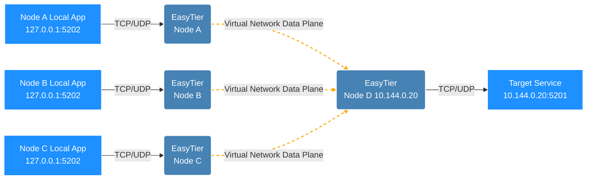

# Port Forward

EasyTier provides a port forward feature that "exposes" TCP/UDP sockets on the host to EasyTier's virtual network (overlay), or forwards host port traffic to a destination address (`dst`) within the virtual network.

Typical use cases:

- Listen on a local port so other nodes in the virtual network can access a local service through that port.
- Start EasyTier on a node in the virtual network, listen on a port, and forward the traffic to a service on another node in the virtual network, without any extra configuration on the target node.
- In no-TUN mode or restricted environments, use port forward as an alternative to TUN-based access to the virtual network.

Supported protocols: `tcp` and `udp`. Each rule consists of three parts: a "bind address (host)", a "dst address (virtual network IPv4)", and a "protocol".

## Network Topology

Assume the network topology is as follows: multiple nodes (A, B, C) want to access the `5201` service on node D in the virtual network via their local port `5202`. Each node configures its own port forward rule to forward local `127.0.0.1:5202` traffic to `10.144.0.20:5201` in the virtual network.



## Using Port Forward

Port forward is configured via the `--port-forward` parameter, in the format:

```
<proto>://<bind_addr>/<dst_addr>
```

- `proto`: protocol, either `tcp` or `udp`.
- `bind_addr`: the listen address on the host, e.g. `127.0.0.1:5202` or `0.0.0.0:5202`.
- `dst_addr`: destination address in the virtual network, must be an IPv4 literal address, e.g. `10.144.0.20:5201`.

`--port-forward` can be specified multiple times to configure multiple forwarding rules.

### TCP Port Forward

Forward local port `127.0.0.1:5202` to `10.144.0.20:5201` in the virtual network:

```sh
sudo easytier-core --port-forward tcp://127.0.0.1:5202/10.144.0.20:5201
```

After startup, any program that can reach the bind address can access the `10.144.0.20:5201` service in the virtual network via `127.0.0.1:5202`.

### UDP Port Forward

Forward local port `127.0.0.1:5202` to `10.144.0.20:5201` in the virtual network:

```sh
sudo easytier-core --port-forward udp://127.0.0.1:5202/10.144.0.20:5201
```

### Configuring Multiple Rules

Multiple rules can be configured at startup by specifying `--port-forward` multiple times, e.g. to expose both TCP and UDP services:

```sh
sudo easytier-core \
  --port-forward tcp://127.0.0.1:5202/10.144.0.20:5201 \
  --port-forward udp://127.0.0.1:5202/10.144.0.20:5201
```

## Configuring via Configuration File

In addition to command-line parameters, port forward rules can be written into the configuration file, corresponding to the `port_forwards` field. Each rule has three fields: `bind_addr`, `dst_addr`, and `proto`:

```toml
[[port_forwards]]
proto = "tcp"
bind_addr = "127.0.0.1:5202"
dst_addr = "10.144.0.20:5201"

[[port_forwards]]
proto = "udp"
bind_addr = "127.0.0.1:5202"
dst_addr = "10.144.0.20:5201"
```

## Modifying Dynamically via Management RPC

While EasyTier is running, port forward rules can be dynamically added or removed via the management RPC (`ConfigRpcService/PatchConfig`) without restarting the instance. This approach is commonly used in iOS/FFI or programmatic integration scenarios, e.g. iOS calls the PatchConfig RPC via `easytier_ios_call_json_rpc` to modify the instance configuration.

## Performance

EasyTier's port forward is built on the virtual network data plane. Native UDP forward can reach close to 999 Mbit/s under a 1 Gbit/s load; TCP forward, after data-plane and host-driver loop optimizations, can reach close to 1.17 Gbit/s per stream. Performance is primarily affected by the data plane and the system network stack. Using the kernel network stack is recommended for higher throughput.

## Limitations and Notes

::: warning Note
- **Bind conflict**: The `(protocol, bind address)` combination must be unique. If two rules share the same `(protocol, bind address)` but have different `dst`, the first one binds successfully and the second one fails at startup because the port/address is already in use. The caller must ensure that `(protocol, bind address)` pairs are unique.
- **Destination address restriction**: `dst_addr` must be an IPv4 literal address in the virtual network. If the destination does not exist in EasyTier's routes, a normal network error is returned and there is no fallback to the host network.
- **UDP large packet reordering**: The Core buffer allows a maximum IPv4 UDP payload of 65507 bytes, but under the current MTU and smoltcp limits, extreme reordering may exceed the number of fragments smoltcp can track (at most 16 segments), causing very large packets to be dropped under high reordering.
- **UDP first inbound packet**: The UDP listening socket installs the precise UDP data-plane flow only after it has sent to a peer. A newly bound socket may not receive the first packet from an unknown peer until mutual flows are established. This behavior does not affect the TUN plane or port-forward destinations reachable via TUN.
:::
