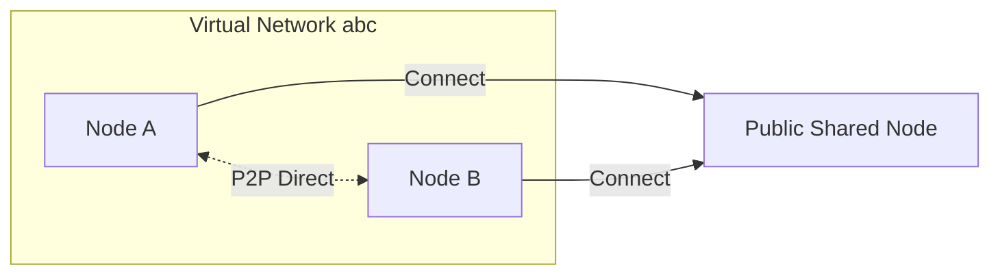
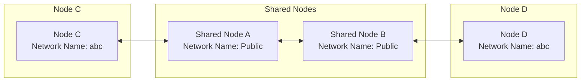

# Quick Networking

## Using Shared Nodes for Networking

When you don't have a public IP, you can use the free shared nodes provided by the EasyTier community for quick networking. Nodes will automatically attempt NAT traversal and establish P2P connections. When P2P fails, data will be relayed through shared nodes.

You can build a simple dual-node virtual network through the following steps:



### Step Example

Assuming there are two nodes A and B:

#### 1. Run on Node A

::: code-group

```sh [Linux]
# Run with administrator privileges
./easytier-core -d --network-name abc --network-secret abc -p tcp://public.easytier.cn:11010
```

```powershell [Windows]
# Run with administrator privileges
.\easytier-core.exe -d --network-name abc --network-secret abc -p tcp://public.easytier.cn:11010
```

:::

- `-d` Automatically assign virtual IP, default allocation is `10.126.126.0/24` network segment, you can use `-i 10.11.11.0/24` to specify other virtual IPs.
- `--network-name` Specify the virtual network name (supports Chinese). Note: If it conflicts with other users' network names, it may cause networking failure.
- `--network-secret` Specify the password for the virtual network, used to protect network security.
- `-p` Specify the node address, here it's the official shared node, you can also use [other public nodes](https://easytier.gd.nkbpal.cn/status/easytier)

#### 2. Run on Node B

::: code-group

```sh [Linux]
# Run with administrator privileges
./easytier-core -d --network-name abc --network-secret abc -p tcp://public.easytier.cn:11010
```

```powershell [Windows]
# Run with administrator privileges
.\easytier-core.exe -d --network-name abc --network-secret abc -p tcp://public.easytier.cn:11010
```

:::

- `-d` Indicates DHCP mode, automatically assign virtual IP
- `-p` Must specify the same shared node as Node A

#### 3. Test Networking

Test connectivity with Node A on Node B:

```sh
ping 10.126.126.1
ping 10.126.126.2
```

::: warning Note
If you cannot ping through, it may be that the firewall is blocking incoming traffic. Please turn off the firewall or add allow rules.
:::

#### 4. Join More Nodes

You can continue running the same command on other nodes to join the same virtual network.

## View Virtual Network Status

After EasyTier starts, you can use easytier-cli to manage and view status.

- View node information in the virtual network:

```sh
easytier-cli peer
```

---

| ipv4         | hostname | cost | lat_ms | loss_rate | rx_bytes | tx_bytes | tunnel_proto | nat_type | id        |
| :----------- | :------- | :--- | :----- | :-------- | :------- | :------- | :----------- | :------- | :-------- |
| 10.144.144.1 | abc-dec  | 1    | 3.452  | 0         | 17.33kB  | 20.42kB  | udp          | FullCone | 390879727 |

- View virtual network routing information:

```sh
easytier-cli route
```

---

| ipv4         | hostname | proxy_cidrs | next_hop_ipv4 | next_hop_hostname | next_hop_lat | cost |
| :----------- | :------- | :---------- | :------------ | :---------------- | :----------- | :--- |
| 10.144.144.1 | abc-dec  |             | DIRECT        |                   | 3.646        | 1    |

- View local node information:

```sh
easytier-cli node
```

---

::: details Output Example

```
┌───────────────┬──────────────────────┐
│ Virtual IP    │ 10.144.144.1         │
├───────────────┼──────────────────────┤
│ Hostname      │ archlinux-base       │
├───────────────┼──────────────────────┤
│ Proxy CIDRs   │ 10.147.223.0/24      │
├───────────────┼──────────────────────┤
│ Peer ID       │ 2616333191           │
├───────────────┼──────────────────────┤
│ Public IP     │ 75.52.125.26         │
├───────────────┼──────────────────────┤
│ UDP Stun Type │ FullCone             │
├───────────────┼──────────────────────┤
│ Listener 1    │ tcp://0.0.0.0:11010  │
├───────────────┼──────────────────────┤
│ Listener 2    │ udp://0.0.0.0:11010  │
├───────────────┼──────────────────────┤
│ Listener 3    │ wg://0.0.0.0:11011   │
├───────────────┼──────────────────────┤
│ Listener 4    │ ws://0.0.0.0:11011/  │
├───────────────┼──────────────────────┤
│ Listener 5    │ wss://0.0.0.0:11012/ │
├───────────────┼──────────────────────┤
│ Listener 6    │ udp://[::]:37039     │
└───────────────┴──────────────────────┘
```

:::

---

## Using Multiple Shared Nodes for Networking

To improve availability, you can connect to multiple shared nodes simultaneously by specifying multiple `-p` parameters:

```sh
-p tcp://1.1.1.1:11010 -p udp://1.1.1.2:11011
```

It's recommended that all nodes specify the same shared node list.

### Networking Principle Diagram

The following diagram shows the networking mode under multiple shared node clusters:

```mermaid
flowchart LR
subgraph Shared Nodes
  nodeA[Shared Node A</br>Network Name: Public]
  nodeB[Shared Node B</br>Network Name: Public]
end
subgraph Node C
  nodeC[Node C</br>Network Name: abc]
end
subgraph Node D
  nodeD[Node D</br>Network Name: abc]
end
nodeA <--> nodeB
nodeC <--> Shared Nodes
nodeD <--> Shared Nodes
```

Even if network partitioning occurs, where C can only connect to A and D can only connect to B, C and D can still communicate:



---

## Joining/Building Multiple Virtual Networks Simultaneously

EasyTier supports running multiple processes on the same device, with each process joining different virtual networks. Note:

- Virtual IP network segments of different virtual networks cannot overlap, otherwise routing conflicts will occur;
- When starting multiple instances, different listening ports must be specified, otherwise port conflicts will occur.

Example:

```sh
# Run with administrator privileges
./easytier-core --network-name net1 -p tcp://public.easytier.cn:11010 -l 11010
./easytier-core --network-name net2 -p tcp://public.easytier.cn:11010 -l 21010
```

- `-l` Specify the listening port.

---

## Setting Up Shared Nodes

If you want to set up your own shared nodes, you can refer to the [Hosting Public Server](host-public-server) documentation.
