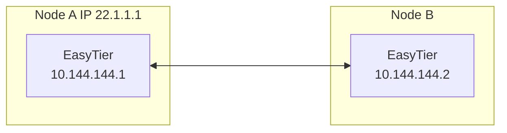

# Two-node Networking

Assuming the network topology of the two nodes is as follows



1. Execute on Node A:

   ```sh
   sudo easytier-core --ipv4 10.144.144.1
   ```

   Successful execution of the command will print the following.

   ```sh
   $ easytier-core --ipv4 10.144.144.1
   Starting easytier with config:
   ############### TOML ##############

   instance_name = "default"
   instance_id = "7294d13c-d119-49ae-a5f7-8c3a912538d7"
   ipv4 = "10.144.144.1"
   listeners = [
       "tcp://0.0.0.0:11010",
       "udp://0.0.0.0:11010",
       "wg://0.0.0.0:11011",
   ]
   peer = []
   rpc_portal = "127.0.0.1:15888"

   [network_identity]
   network_name = "default"
   network_secret = ""

   [flags]
   default_protocol = "tcp"
   enable_encryption = true
   enable_ipv6 = true

   -----------------------------------
   xxxx-xx-xx xx:xx:xx: tun device ready. dev: tun0
   xxxx-xx-xx xx:xx:xx: new listener added. listener: tcp://0.0.0.0:11010
   xxxx-xx-xx xx:xx:xx: new listener added. listener: udp://0.0.0.0:11010
   ```

2. Execute on Node B

   ```sh
   sudo easytier-core --ipv4 10.144.144.2 --peers udp://22.1.1.1:11010
   ```

3. Test Connectivity

   The two nodes should connect successfully and be able to communicate within the virtual subnet

   ```sh
   ping 10.144.144.2
   ```

   Use easytier-cli to view node information in the subnet

   ```sh
   easytier-cli peer
   ```

   | ipv4         | hostname | cost | lat_ms | loss_rate | rx_bytes | tx_bytes | tunnel_proto | nat_type | id        |
   | :----------- | :------- | :--- | :----- | :-------- | :------- | :------- | :----------- | :------- | :-------- |
   | 10.144.144.1 | abc-dec  | 1    | 3.452  | 0         | 17.33kB  | 20.42kB  | udp          | FullCone | 390879727 |

   ```sh
   easytier-cli route
   ```

   | ipv4         | hostname | proxy_cidrs | next_hop_ipv4 | next_hop_hostname | next_hop_lat | cost |
   | :----------- | :------- | :---------- | :------------ | :---------------- | :----------- | :--- |
   | 10.144.144.1 | abc-dec  |             | DIRECT        |                   | 3.646        | 1    |

---
