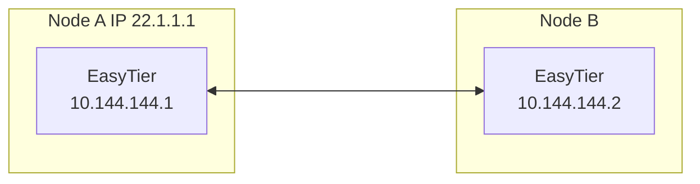

# Two-node Networking
 
Assuming the network topology of the two nodes is as follows
 


1. Execute on Node A:
   ```sh
   sudo easytier-core --ipv4 10.144.144.1
   ```
   Successful execution of the command will print the following.

   

2. Execute on Node B
   ```sh
   sudo easytier-core --ipv4 10.144.144.2 --peers udp://22.1.1.1:11010
   ```

3. Test Connectivity

   The two nodes should connect successfully and be able to communicate within the virtual subnet
   ```sh
   ping 10.144.144.2
   ```

   Use easytier-cli to view node information in the subnet
   ```sh
   easytier-cli peer
   ```
   
   ```sh
   easytier-cli route
   ```
   

---