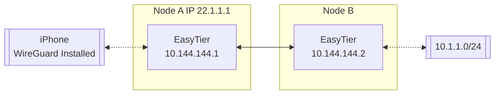

# Use EasyTier with WireGuard Client

EasyTier can be used as a WireGuard server to allow any device with WireGuard client installed to access the EasyTier network. For platforms currently unsupported by EasyTier (such as iOS), this method can be used to connect to the EasyTier network.

Assuming the network topology is as follows:



To enable an iPhone to access the EasyTier network through Node A, the following configuration can be applied:

Include the --vpn-portal parameter in the easytier-core command on Node A to specify the port that the WireGuard service listens on and the subnet used by the WireGuard network.

```sh
# The following parameters mean: listen on port 0.0.0.0:11013, and use the 10.14.14.0/24 subnet for WireGuard
sudo easytier-core --ipv4 10.144.144.1 --vpn-portal wg://0.0.0.0:11013/10.14.14.0/24
```

After successfully starting easytier-core, use easytier-cli to obtain the WireGuard client configuration.

```sh
$> easytier-cli vpn-portal
portal_name: wireguard

client_config:
[Interface]
PrivateKey = 9VDvlaIC9XHUvRuE06hD2CEDrtGF+0lDthgr9SZfIho=
Address = 10.14.14.0/24 # should assign an ip from this cidr manually

[Peer]
PublicKey = zhrZQg4QdPZs8CajT3r4fmzcNsWpBL9ImQCUsnlXyGM=
AllowedIPs = 192.168.80.0/20,10.147.223.0/24,10.144.144.0/24
Endpoint = 0.0.0.0:11013 # should be the public ip of the vpn server

connected_clients:
[]

```

Before using the Client Config, you need to modify the Interface Address and Peer Endpoint to the client's IP and the IP of the EasyTier node, respectively. Import the configuration file into the WireGuard client to access the EasyTier network.
