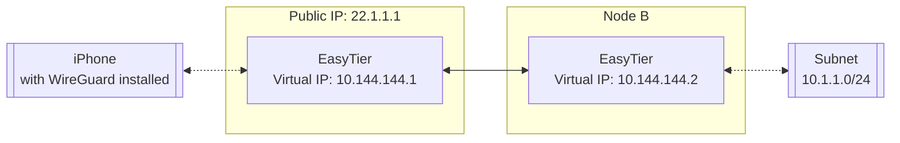

# Connect Using WireGuard Client

EasyTier can be used as a WireGuard server, allowing any device with a WireGuard client installed to access the EasyTier network. For platforms currently not supported by EasyTier, this method can be used to connect to the EasyTier network.

## Network Topology

Assume the network topology is as follows, where node A and node B use the [two-node networking](decentralized-networking#two-nodes) method, and node B proxies the `10.1.1.0/24` subnet through [subnet proxy](point-to-networking).



We need the iPhone to access the EasyTier network through node A, and the configuration can be as follows.

## Configuration Steps

### 1. Configure Node A

In the `easytier-core` command on node A, add the `--vpn-portal` parameter to specify the port WireGuard listens on and the subnet used by the WireGuard network.

```sh
# The following parameters mean: listen on 0.0.0.0:11013 port, WireGuard uses the 10.14.14.0/24 subnet
sudo easytier-core --ipv4 10.144.144.1 --vpn-portal wg://0.0.0.0:11013/10.14.14.0/24
```

### 2. Get WireGuard Client Configuration

After `easytier-core` starts successfully, use `easytier-cli` to get the WireGuard client configuration.

```sh
$> easytier-cli vpn-portal
portal_name: wireguard

client_config:
[Interface]
PrivateKey = 9VDvlaIC9XHUvRuE06hD2CEDrtGF+0lDthgr9SZfIho=
Address = 10.14.14.0/24 # should assign an ip from this cidr manually

[Peer]
PublicKey = zhrZQg4QdPZs8CajT3r4fmzcNsWpBL9ImQCUsnlXyGM=
AllowedIPs = 192.168.80.0/20,10.147.223.0/24,10.144.144.0/24
Endpoint = 0.0.0.0:11013 # should be the public ip of the easytier server

connected_clients:
[]
```

## Using Client Configuration

Before using the Client Config, you need to modify the following fields to actual values:

- **Interface Address**: Modify to the client's IP, such as `10.14.14.1/24`. If connecting multiple WireGuard clients, ensure each client has a different IP.
- **Peer Endpoint**: Modify to the public IP and port of EasyTier node A `22.1.1.11:11013`.

Import the configuration file into the WireGuard client to access the EasyTier network.

::: tip Note
If you need to support multiple clients, you can specify a larger subnet in the `--vpn-portal` parameter of `easytier-core`, such as `10.14.0.0/16`.
:::

## Notes

All traffic from WireGuard clients accessing the EasyTier virtual network will go through EasyTier node A. You need to ensure that node A's network connection is stable, and generally node A needs to have a public IP for convenient use.

---
