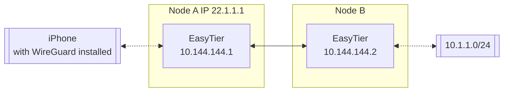

# Connect Using WireGuard Client

EasyTier can be used as a WireGuard server, allowing any device with a WireGuard client installed to access the EasyTier network. For platforms currently not supported by EasyTier (such as iOS), this method can be used to connect to the EasyTier network.

Assume the network topology is as follows:



We need the iPhone to access the EasyTier network through Node A, and the configuration can be as follows:

In the easytier-core command on Node A, add the --vpn-portal parameter to specify the port WireGuard listens on and the subnet used by the WireGuard network.

```sh
# The following parameters mean: listen on port 11013 on 0.0.0.0, WireGuard uses the 10.14.14.0/24 subnet
sudo easytier-core --ipv4 10.144.144.1 --vpn-portal wg://0.0.0.0:11013/10.14.14.0/24
```

After easytier-core starts successfully, use easytier-cli to get the WireGuard Client configuration.

```sh
$> easytier-cli vpn-portal
portal_name: wireguard

client_config:
[Interface]
PrivateKey = 9VDvlaIC9XHUvRuE06hD2CEDrtGF+0lDthgr9SZfIho=
Address = 10.14.14.0/24 # should assign an ip from this cidr manually

[Peer]
PublicKey = zhrZQg4QdPZs8CajT3r4fmzcNsWpBL9ImQCUsnlXyGM=
AllowedIPs = 192.168.80.0/20,10.147.223.0/24,10.144.144.0/24
Endpoint = 0.0.0.0:11013 # should be the public ip of the easytier server

connected_clients:
[]

```

Before using the Client Config, you need to modify the Interface Address and Peer Endpoint to the client's IP and the EasyTier node's IP, respectively. Import the configuration file into the WireGuard client to access the EasyTier network.

---
