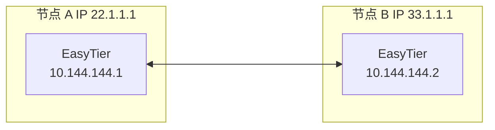
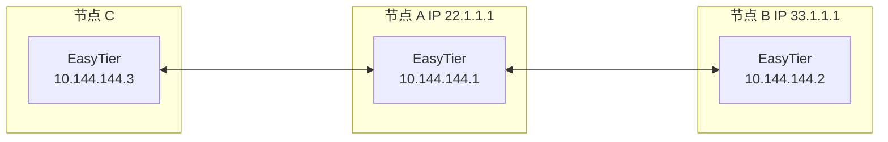

# 去中心组网

绝大多数组网软件是中心化的，所有设备必须与中心服务器建连才可组网。

EasyTier 是去中心化的，不区分服务器和客户端，只要一个设备可以与虚拟网中任意一个节点通信，就可以加入虚拟网。

## 双节点组网

假设双节点的网络拓扑如下



1. 在节点 A 上执行以下命令：

   ```sh
   sudo easytier-core -i 10.144.144.1
   ```

2. 在节点 B 执行以下命令：

   ```sh
   sudo easytier-core -d -p udp://22.1.1.1:11010
   ```

   其中 `-d` 代表 DHCP 模式，EasyTier 会自动获取一个 IP 地址。

## 说明
默认情况下， Easytier 会监听 IPv4 和 IPv6 的 TCP 和 UDP 的 11010、11011、11012（只有 TCP） 端口，其中 11010 为 TCP 和 UDP 协议， 11011 为 [Websocket](https://blog.csdn.net/aiwokache/article/details/117294920) 和 [Wireguard]

(https://zh-wireguard.com/) 协议， 11012 为 [Websocket Security](https://blog.csdn.net/m0_61560439/article/details/130319370) 协议。

注意：在使用 Easytier 组网时，上面提到的协议可以在防火墙只放行所需要的协议，例如节点 B 希望通过 UDP 协议连接节点 A ，那么节点 A 只需要在防护墙放行 UDP 11010 这个端口即可。

其中节点 A 的 IP 22.1.1.1 为运营商为其分配的公网IP ，节点 B 同理。


## 三节点组网

基于刚才的双节点组网例子，第三个节点 C 如果要加入虚拟网，既可以连接到节点 A，也可以连接到节点 B。

假设通过连接到节点 A 组网，网络拓扑如下:



在节点 C 上执行：

```sh
sudo easytier-core -d -p udp://22.1.1.1:11010
```

随后 C 即可与 A 和 B 通过虚拟网通信。
