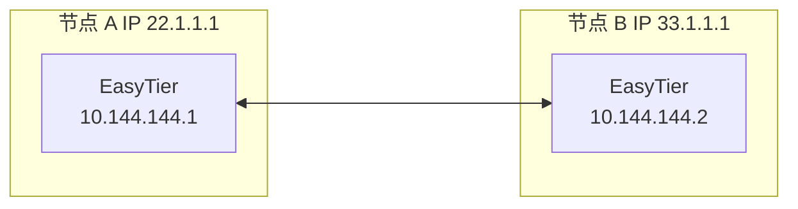
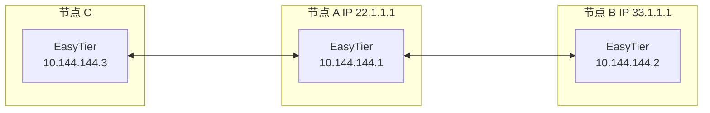

# 去中心组网

绝大多数组网软件是中心化的，所有设备必须与中心服务器建立连接才可组网。

EasyTier 是去中心化的，不区分服务器和客户端，只要一个设备可以与虚拟网中任意一个节点通信，就可以加入虚拟网。

即：如果您的某个设备可以在外网被其他设备访问，即可通过 Easytier 进行组网，不需要中心服务器。

## 双节点组网

假设双节点的网络拓扑如下，其中节点 A 的 IP 为公网，节点 B 的 IP 为普通家庭宽带分配的共享公网IP（无法被其他设备访问）:



1. 在节点 A 上执行以下命令：

   ```sh
   sudo easytier-core -i 10.144.144.1 -network-name test -network-secret test
   ```

2. 在节点 B 执行以下命令：

   ```sh
   sudo easytier-core -d -p udp://22.1.1.1:11010 -network-name test -network-secret test
   ```

   其中 `-d` 代表 DHCP 模式，EasyTier 会自动获取一个 IP 地址。

默认情况下， Easytier 会监听 IPv4 和 IPv6 的 TCP 和 UDP 的 11010、11011、11012（只有 TCP） 端口，其中 11010 为 TCP 和 UDP 协议， 11011 为 [Websocket](https://websocket.xiniushu.com/introduction) 和 [Wireguard]

(https://zh-wireguard.com) 协议， 11012 为 Websocket Security（通过SSL或TLS加密的Websocket）协议。

::: warning 注意
在使用 Easytier 组网时，上面提到的协议可以在防火墙只放行所需要的协议，例如节点 B 希望通过 UDP 协议连接节点 A ，那么节点 A 只需要在防火墙放行 UDP 11010 这个端口即可。
节点 A 的公网 IP 可以是 IPv4 也可是 IPv6，需要保证节点 B 也拥有 IPV4 或 IPv6 地址，即 IPv4 只能连接 IPv4 ，IPv6 只能连接 IPv6 。
:::

## 三节点组网

基于刚才的双节点组网例子，第三个节点 C 如果要加入虚拟网，假设通过连接到节点 A 组网，网络拓扑如下:



在节点 C 上执行以下命令：

```sh
sudo easytier-core -d -p udp://22.1.1.1:11010 -network-name test -network-secret test
```

随后 C 即可与 A 和 B 通过虚拟网通信。

如果您想私有化部署 Easytier ，即不想被他人访问您的虚拟网络，需要在拥有公网 IP 的节点 A 执行以下命令：

```sh
sudo easytier-core -i 10.144.144.1 -relay-network-whitelist 您的网络名 -relay-all-peer-rpc false
```

> `-relay-network-whitelist` 代表网络白名单，即仅转发白名单内网络的流量；
> 支持通配符字符串，多个网络名称间可以使用英文空格间隔；
> 节点 A 的网络名（network-name）不在白名单中，如果没有其他路由路径可用，流量仍然可以转发；
> 如果该参数为空，则禁用转发，默认情况下允许所有网络转发；
> 例如：'*'（所有网络名），'def*'（以def为前缀的网络名），'net1 net2'（只允许net1和net2）；
> `-relay-all-peer-rpc` 代表转发所有节点的 RPC 数据包，即使节点不在转发网络白名单中。
> 这可以帮助白名单外网络中的对等节点建立 P2P 连接；
> 禁用该参数后仅帮助白名单内的网络建立 P2P 连接。
