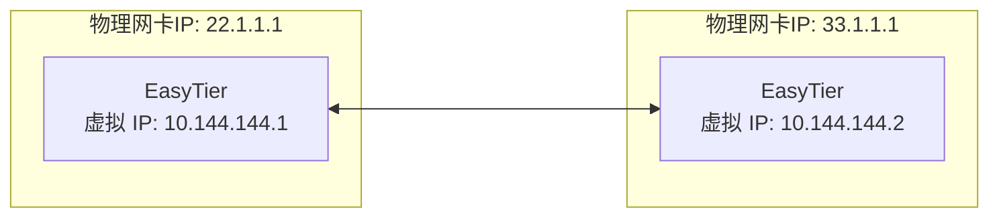
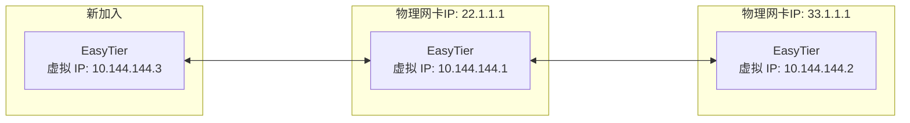

# 去中心组网

绝大多数组网软件是中心化的，所有设备必须与中心服务器建连才可组网。

EasyTier 是去中心化的，不区分服务器和客户端，只要一个设备可以与虚拟网中任意一个节点通信，就可以加入虚拟网。

## 双节点组网 {#two-nodes}

假设双节点的网络拓扑如下：



### 步骤

1. 在节点 A 上运行以下命令：

   ```sh
   sudo easytier-core -i 10.144.144.1
   ```

   - `-i` 指定虚拟网的 IP 地址。

   该节点启动后会默认监听以下端口：

   | 协议          | 默认端口    |
   | ------------- | ----------- |
   | TCP           | 11010 (TCP) |
   | UDP           | 11010 (UDP) |
   | WebSocket     | 11011 (TCP) |
   | WebSocket SSL | 11012 (TCP) |
   | WireGuard     | 11013 (UDP) |

   可以通过 `-l` 参数指定监听端口，例如：

   | 参数示例                    | 说明                                                                                                                       |
   | --------------------------- | -------------------------------------------------------------------------------------------------------------------------- |
   | `-l 12345`                  | 将端口的基准端口改为 12345，则监听端口为：TCP: 12345, UDP: 12345, WebSocket: 12346, WebSocket SSL: 12347, WireGuard: 12348 |
   | `-l tcp:11010 -l udp:11011` | 将 TCP 端口改为 11010，UDP 端口改为 11011，仅监听这两个端口。支持的协议有 `tcp`、`udp`、`ws`、`wss`、`wg`                  |
   | `--no-listener`             | 禁止监听端口，会影响非打洞连接的建立。                                                                                     |

2. 在节点 B 上运行以下命令：

   ```sh
   sudo easytier-core -d -p udp://22.1.1.1:11010
   ```

   - `-d` 表示 DHCP 模式，自动分配虚拟 IP。
   - `-p` 指定节点 A 的公网地址和端口。


## 三节点组网

基于双节点组网，第三个节点 C 可以连接到节点 A 或节点 B 加入虚拟网。

假设通过连接到节点 A 组网，网络拓扑如下：



### 步骤

1. 在节点 C 上运行以下命令：

   ```sh
   sudo easytier-core -d -p udp://22.1.1.1:11010
   ```

   - `-d` 表示 DHCP 模式，自动分配虚拟 IP。
   - `-p` 指定节点 A 的公网地址和端口。

随后节点 C 即可与节点 A 和节点 B 通过虚拟网通信。
