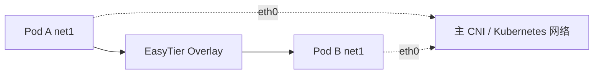

# EasyTier CNI（Kubernetes）

EasyTier CNI 可以通过 Multus 为 Kubernetes Pod 添加一个 EasyTier TUN 辅助网卡。Pod 原有的主 CNI 网卡继续负责集群 Service、DNS 和 EasyTier 底层连接，EasyTier 网络只承载分配给辅助网卡的虚拟网段流量。



::: warning 当前范围
首版仅支持 CNI `1.0.0`、单个 IPv4 地址和 Multus standalone delegate。不修改 Pod 默认路由和 DNS，也不支持 Primary CNI、IPv6 或 chained `prevResult`。
:::

## 前置条件

- Linux Kubernetes 节点，且存在 `/dev/net/tun`。
- 已安装 [Multus CNI](https://github.com/k8snetworkplumbingwg/multus-cni)。
- 已安装 [Whereabouts](https://github.com/k8snetworkplumbingwg/whereabouts)，或其他能返回单个 IPv4 且不返回额外路由的 IPAM 插件。
- 每个 Pod 的主网络都能访问至少一个 EasyTier peer。
- EasyTier 镜像包含 `easytier-core` 和 `easytier-cni`。

## 与 Flannel 共存

EasyTier CNI 不会替换或修改 Flannel。Flannel 继续提供 Pod 的 `eth0` 主网卡，Multus 将 EasyTier 作为 `net1` 辅助网卡调用。

已有 Flannel 集群不需要重新安装 Flannel。使用 Flannel 上游清单部署时，可通过以下命令确认 Flannel 和节点正常；发行版内置或 Helm 部署请使用实际的 namespace 和 DaemonSet 名称：

```sh
kubectl -n kube-flannel rollout status daemonset/kube-flannel-ds --timeout=5m
kubectl wait node --all --for=condition=Ready --timeout=5m
```

Flannel 自身仍需要 `bridge`、`host-local`、`portmap` 等标准 CNI plugins 以及 `br_netfilter` 内核模块；EasyTier CNI 不负责安装这些 Flannel 前置依赖。

确认主网络正常后，依次安装 Multus、Whereabouts 和 EasyTier CNI。新集群必须先按照 [Flannel 文档](https://github.com/flannel-io/flannel#deploying-flannel-manually)完成安装并等待节点 Ready。Multus 自动配置模式会选择已有的 Flannel 配置作为默认网络；手工配置 Multus 时也要把 Flannel 设为默认 delegate。不要把 EasyTier 配置加入 Flannel conflist，EasyTier 只通过本页后续创建的 `NetworkAttachmentDefinition` 接入。

Flannel 默认使用 `10.244.0.0/16` 时，可以使用本页示例中的 EasyTier `10.200.0.0/24`，但仍需检查它是否与实际环境的其他网络重叠。

::: tip 已验证组合
三节点 Kind 测试关闭了默认 kindnet，以 Flannel `v0.28.9` 作为唯一主 CNI，并安装 Multus `v4.3.0` 和 Whereabouts `v0.9.4`。测试覆盖不同 worker 上 Pod 的 `net1` 跨节点 ping 和 HTTP、Flannel 主网络 Service/DNS、MTU、删除及 IPAM 地址回收。
:::

::: warning 安全提示
节点 DaemonSet 需要进入 Pod network namespace 并创建 TUN，因此会使用 privileged、hostPID 和宿主 `/run`。生产环境必须固定到包含 CNI 的正式 EasyTier 版本，不要直接使用可变的 `unstable` 标签。
:::

## 1. 创建网络密钥

不要把 EasyTier 网络密钥写进 `NetworkAttachmentDefinition`：

```sh
kubectl -n kube-system create secret generic easytier-cni \
  --from-literal=network-secret="$EASYTIER_NETWORK_SECRET"
```

DaemonSet 会把密钥以 root-only 文件安装到节点。管理 RPC 使用节点上的 root-only Unix socket，不会开放 TCP 管理端口。

## 2. 部署节点 DaemonSet

下载[官方 DaemonSet 清单](https://github.com/EasyTier/EasyTier/blob/main/easytier-contrib/easytier-cni/deploy/daemonset.yaml)，把两个 EasyTier 镜像都固定到相同的正式版本，然后部署：

```sh
kubectl apply -f daemonset.yaml
kubectl -n kube-system rollout status daemonset/easytier-cni
```

确认每个节点都安装了插件并启动管理进程：

```sh
kubectl -n kube-system get pods -l app.kubernetes.io/name=easytier-cni -o wide
```

## 3. 创建辅助网络

以[官方 NAD 示例](https://github.com/EasyTier/EasyTier/blob/main/easytier-contrib/easytier-cni/deploy/network-attachment-definition.yaml)为基础修改：

```json
{
  "cniVersion": "1.0.0",
  "name": "easytier",
  "type": "easytier-cni",
  "rpcPortal": "unix:///run/easytier-cni/rpc.sock",
  "networkName": "kubernetes",
  "networkSecretFile": "/etc/easytier-cni/network-secret",
  "peers": ["tcp://192.0.2.10:11010"],
  "mtu": 1380,
  "timeoutSeconds": 30,
  "ipam": {
    "type": "whereabouts",
    "range": "10.200.0.0/24",
    "range_start": "10.200.0.10",
    "range_end": "10.200.0.250"
  }
}
```

- `peers` 必须能通过 Pod 主网卡访问。建议使用 IP 地址，避免 CNI 阶段依赖集群 DNS。
- EasyTier 地址段不能与节点、Pod、Service、局域网、VPN 或容器运行时网段重叠。
- `mtu` 是 EasyTier packet MTU；TUN MTU 会扣除协议开销，例如 `1380` 对应 TUN MTU `1360`。

完成修改后应用 NAD：

```sh
kubectl apply -f network-attachment-definition.yaml
```

## 4. 为 Pod 添加 EasyTier 网络

在 Pod 上添加 Multus 注解：

```yaml
apiVersion: v1
kind: Pod
metadata:
  name: easytier-client
  annotations:
    k8s.v1.cni.cncf.io/networks: easytier
spec:
  containers:
    - name: client
      image: busybox:1.37.0
      command: ["/bin/sh", "-c", "sleep 3600"]
```

默认辅助网卡名为 `net1`。检查地址和 Multus 网络状态：

```sh
kubectl exec easytier-client -- ip address show net1
kubectl get pod easytier-client \
  -o jsonpath='{.metadata.annotations.k8s\.v1\.cni\.cncf\.io/network-status}'
```

两个 Pod 都连接到相同 EasyTier 网络后，可以直接通过各自的 `net1` IPv4 地址通信。

## 运维注意事项

- 删除 Pod 时，CNI 会删除对应 EasyTier 实例并释放 Whereabouts 地址。
- 节点 daemon 会在 `/var/lib/easytier-cni/configs` 持久化 attachment；目录包含网络凭据，只允许 root 访问。
- 更新 Secret 后，需要重启 `easytier-cni` DaemonSet，并重建已挂载 EasyTier 网络的 Pod。
- 卸载后按需删除节点上的 `/etc/easytier-cni` 和 `/var/lib/easytier-cni`。

完整配置、自动化 netns 测试和 Kind 三节点测试位于 [`easytier-contrib/easytier-cni`](https://github.com/EasyTier/EasyTier/tree/main/easytier-contrib/easytier-cni)。
