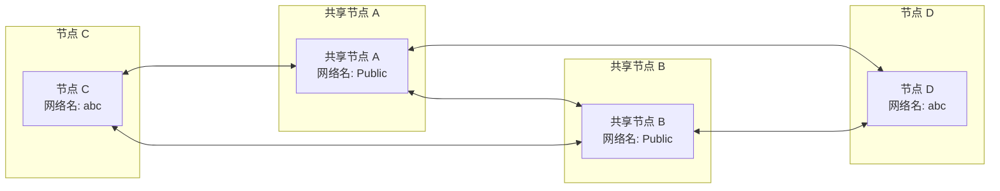
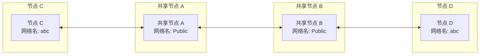

# 快速组网

## 利用共享节点组网

当你没有公网 IP 时，可以使用 EasyTier 社区提供的免费共享节点快速组网。节点间成功组网后，
会自动尝试 NAT 穿透并建立 P2P 连接，在成功 P2P 之前，共享节点会帮助转发数据。

假设有两个节点 A 和 B：

1. 在节点 A 上执行（请替换 abc 为更复杂的网络名，否则会因为网络名冲突导致连接失败）

   ```sh
   sudo easytier-core -i 10.144.144.1 --network-name abc --network-secret abc -p tcp://public.easytier.cn:11010
   ```

   > `-i` 代表指定虚拟网 IP 地址，默认 /24 网段;
   >
   > `--network-name` 和 `--network-secret` 代表网络名和网络密钥；
   >
   > `-p` 代表指定节点地址，此处使用官方的共享节点。

2. 在节点 B 上执行

   ```sh
   sudo easytier-core -d --network-name abc --network-secret abc -p tcp://public.easytier.cn:11010
   ```

   > `-d` 代表 DHCP 模式，EasyTier 会自动获取一个 IP 地址。

3. 测试联通性

   两个节点应成功连接并能够在虚拟子网内通信，可以在节点 B 上执行进行测试。

   ```sh
   ping 10.144.144.1
   ```

::: warning 注意
部分系统默认开启防火墙并会阻止入站流量，可能会导致虚拟 IP 无法 ping 通或无法访问各种服务，需要手动关闭防火墙或添加规则。
:::

## 查看虚拟网状态

easytier-core 启动后，可以使用 easytier-cli 进行管理。

- 查看虚拟网中的节点信息

```sh
easytier-cli peer
```

| ipv4         | hostname | cost | lat_ms | loss_rate | rx_bytes | tx_bytes | tunnel_proto | nat_type | id        |
| :----------- | :------- | :--- | :----- | :-------- | :------- | :------- | :----------- | :------- | :-------- |
| 10.144.144.1 | abc-dec  | 1    | 3.452  | 0         | 17.33kB  | 20.42kB  | udp          | FullCone | 390879727 |

- 查看虚拟网路由信息

```sh
easytier-cli route
```

| ipv4         | hostname | proxy_cidrs | next_hop_ipv4 | next_hop_hostname | next_hop_lat | cost |
| :----------- | :------- | :---------- | :------------ | :---------------- | :----------- | :--- |
| 10.144.144.1 | abc-dec  |             | DIRECT        |                   | 3.646        | 1    |

- 查看本节点的信息

```sh
easytier-cli node
```

```
┌───────────────┬──────────────────────┐
│ Virtual IP    │ 10.144.144.1         │
├───────────────┼──────────────────────┤
│ Hostname      │ archlinux-base       │
├───────────────┼──────────────────────┤
│ Proxy CIDRs   │ 10.147.223.0/24      │
├───────────────┼──────────────────────┤
│ Peer ID       │ 2616333191           │
├───────────────┼──────────────────────┤
│ Public IP     │ 75.52.125.26         │
├───────────────┼──────────────────────┤
│ UDP Stun Type │ FullCone             │
├───────────────┼──────────────────────┤
│ Listener 1    │ tcp://0.0.0.0:11010  │
├───────────────┼──────────────────────┤
│ Listener 2    │ udp://0.0.0.0:11010  │
├───────────────┼──────────────────────┤
│ Listener 3    │ wg://0.0.0.0:11011   │
├───────────────┼──────────────────────┤
│ Listener 4    │ ws://0.0.0.0:11011/  │
├───────────────┼──────────────────────┤
│ Listener 5    │ wss://0.0.0.0:11012/ │
├───────────────┼──────────────────────┤
│ Listener 6    │ udp://[::]:37039     │
└───────────────┴──────────────────────┘
```

## 使用多个共享节点

为了避免单个共享节点故障导致虚拟网不可用，可以同时连接到多个共享节点。只需要指定多个 -p 参数即可，如：`-p tcp://1.1.1.1:11010 -p udp://1.1.1.2:11011`。虚拟网中每个节点最好指定相同的公共服务器列表。

这依赖了 EasyTier 所支持的共享节点集群功能，假设有 A 和 B 两个共享节点，这两个共享节点互联组成集群。当 C 和 D 希望组网时，C 和 D 可以同时连接到 A 和 B，这样即使 A 或 B 故障，C 和 D 之间依然可以通信。组网模式如图所示：



即使出现网络分区，即 C 只能连接到 A，D 只能连接到 B，C 和 D 之间依然可以通信。


