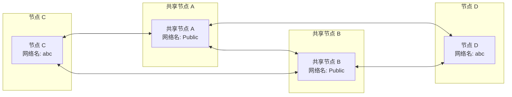
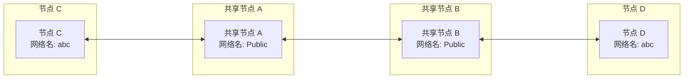

# 快速组网

## 利用共享节点组网

当你没有公网 IP 时，可以使用 EasyTier 社区提供的免费共享节点快速组网。节点间成功组网后，会自动尝试 NAT 穿透并建立 P2P 连接，在成功 P2P 之前，共享节点会帮助转发数据。

注意：在 Easytier 中只有节点的概念，以下的共享节点可以理解为中心化组网中的公共服务器。

假设有两个节点 A 和 B：

1. 在节点 A 上执行以下命令：

   ```sh
   sudo easytier-core -i 10.144.144.1 --network-name abc --network-secret abc -p tcp://public.easytier.cn:11010
   ```

   > `-i` 代表指定虚拟网 IPv4 地址，默认 /24 网段;
   > 
   > 例如：10.0.0.1/8 172.16.0.1/16 192.168.0.1/24；
   > 
   > 注意：目前 Easytier 没有虚拟 IPv6 地址（意义不大）;
   > 
   > `--network-name` 和 `--network-secret` 为网络名和网络密钥；
   > 
   > 可以使用 Unicode 字符，例如 --network-name 测试 --network-secret 测试 ;
   > 
   > `-p` 代表指定节点地址，此处使用官方的共享节点。
   > 
   > 也可使用其他地址，如 Easytier 公共服务器列表中的地址。
   >
   
::: warning 注意
由于默认使用的是 Easytier 官方的公共节点，服务器压力过大经常会造成延迟高、无法组网等问题，建议使用其他[公共节点](https://easytier.gd.nkbpal.cn/status/easytier)来组网。
此外在 Easytier 中 network-name 的优先级是最高的，对于每一个节点来说，只能有一个名称相同的 network-name 。 
:::

3. 在节点 B 上执行

   ```sh
   sudo easytier-core -d --network-name abc --network-secret abc -p tcp://public.easytier.cn:11010
   ```

   > `-d` 代表 DHCP 模式，EasyTier 会自动获取一个虚拟 IP 地址。
   >
   > 注意：在该例子中，由于没有公网 IP ，在进行组网时，请使用相同的公共服务器进行组网。
   > 
   > 如果您想在节点 A 和 节点 B 上使用不同的共享节点进行组网，请参考本节的 Easytier 集群功能。

4. 测试是否组网成功

   测试两个节点是否成功连接并能够在虚拟子网内通信，可以在节点 B 上执行以下命令进行测试。

   ```sh
   ping 10.144.144.1
   ```

::: warning 注意
一般来说系统默认开启防火墙并会阻止入站流量，很大概率会导致虚拟 IP 无法 ping 通或无法访问各种服务，需要手动关闭防火墙或添加规则放行。
:::

## 查看虚拟网络状态

easytier-core 成功启动后，可以使用 easytier-cli 进行管理。

- 可执行以下命令来查看虚拟网中的节点信息

```sh
easytier-cli peer
```

| ipv4         | hostname | cost | lat_ms | loss_rate | rx_bytes | tx_bytes | tunnel_proto | nat_type | id        |
| :----------- | :------- | :--- | :----- | :-------- | :------- | :------- | :----------- | :------- | :-------- |
| 10.144.144.1 | abc-dec  | 1    | 3.452  | 0         | 17.33kB  | 20.42kB  | udp          | FullCone | 390879727 |

- 查看虚拟网路由信息

```sh
easytier-cli route
```

| ipv4         | hostname | proxy_cidrs | next_hop_ipv4 | next_hop_hostname | next_hop_lat | cost |
| :----------- | :------- | :---------- | :------------ | :---------------- | :----------- | :--- |
| 10.144.144.1 | abc-dec  |             | DIRECT        |                   | 3.646        | 1    |

- 查看本节点的信息

```sh
easytier-cli node
```

```
┌───────────────┬──────────────────────┐
│ Virtual IP    │ 10.144.144.1         │
├───────────────┼──────────────────────┤
│ Hostname      │ archlinux-base       │
├───────────────┼──────────────────────┤
│ Proxy CIDRs   │ 10.147.223.0/24      │
├───────────────┼──────────────────────┤
│ Peer ID       │ 2616333191           │
├───────────────┼──────────────────────┤
│ Public IP     │ 75.52.125.26         │
├───────────────┼──────────────────────┤
│ UDP Stun Type │ FullCone             │
├───────────────┼──────────────────────┤
│ Listener 1    │ tcp://0.0.0.0:11010  │
├───────────────┼──────────────────────┤
│ Listener 2    │ udp://0.0.0.0:11010  │
├───────────────┼──────────────────────┤
│ Listener 3    │ wg://0.0.0.0:11011   │
├───────────────┼──────────────────────┤
│ Listener 4    │ ws://0.0.0.0:11011/  │
├───────────────┼──────────────────────┤
│ Listener 5    │ wss://0.0.0.0:11012/ │
├───────────────┼──────────────────────┤
│ Listener 6    │ udp://[::]:37039     │
└───────────────┴──────────────────────┘
```

## 同时使用多个共享节点组网

为了避免单个共享节点故障导致虚拟网不可用，可以同时连接到多个共享节点。只需要指定多个 -p 参数即可，如：`-p tcp://1.1.1.1:11010 -p udp://1.1.1.2:11011`。虚拟网中每个节点最好指定相同的共享节点列表。

这依赖了 EasyTier 所支持的共享节点集群功能，假设有 A 和 B 两个共享节点，这两个共享节点互联组成集群。当 C 和 D 希望组网时，C 和 D 可以同时连接到 A 和 B，这样即使 A 或 B 故障，C 和 D 之间依然可以通信。组网模式如图所示：



即使出现网络分区，C 因为某种原因只能连接到 A，D 因为某种原因只能连接到 B，C 和 D 之间依然可以通信，即两端使用了不同的共享节点依然能够进行组网。



## 同时加入/组建多个虚拟网络

EasyTier 支持在同一个设备上同时运行多个进程，每个进程启动时使用不同参数即可加入不同的虚拟网。
需要注意，多个虚拟网的虚拟 IP 网段不应该重叠，否则会导致路由冲突。

另外，启动多个 EasyTier 实例时，需要指定不同的监听器端口，否则会导致端口冲突。

比如可以使用如下命令启动两个 EasyTier 进程：

```sh
sudo easytier-core --network-name net1 -p tcp://public.easytier.cn:11010 -l 11010
sudo easytier-core --network-name net2 -p tcp://public.easytier.cn:11010 -l 21010
```

> `-l` 代表指定监听器端口。
