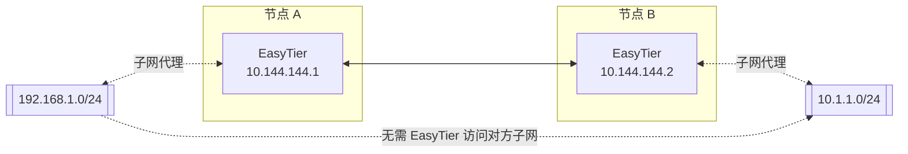

# 网对网

网对网的网络拓扑如图所示



网对网配置成功后，192.168.1.0/24 子网的设备可以访问 10.1.1.0/24 子网的设备互相通信且无需安装 EasyTier。

## Linux 网对网配置

要实现网对网，需要 节点 A 是 192.168.1.0/24 子网的网关。两个 EasyTier 节点的启动及配置参数如下：

节点 A

```bash
# 启动 EasyTier 并代理 192.168.1.0/24 网段，并使用公共服务器帮助组网
easytier-core -i 10.144.144.1 -n 192.168.1.0/24 -p tcp://<共享节点IP>:11010 --network-name n2n_test

# 允许网关转发流量，并配置防火墙允许转发流量
sysctl -w net.ipv4.ip_forward=1
iptables -A FORWARD -s 192.168.1.0/24 -j ACCEPT
iptables -A FORWARD -d 192.168.1.0/24 -j ACCEPT
```

节点 B

```bash
# 启动 EasyTier 并代理 10.1.1.0/24 网段，并使用公共服务器帮助组网
easytier-core -i 10.144.144.2 -n 10.1.1.0/24 -p tcp://<共享节点IP>:11010 --network-name n2n_test
```
