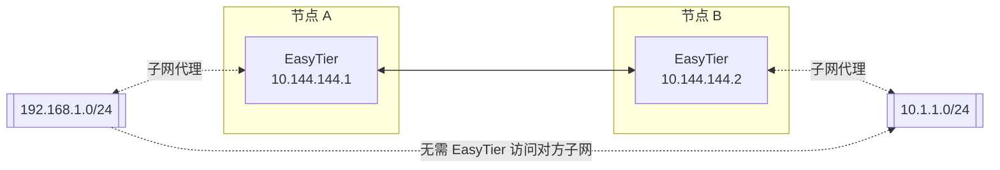

# 网对网

网对网的网络拓扑如图所示


```mermaid
flowchart LR

subgraph 节点 A
nodeA[EasyTier</br>10.144.144.1]
end

subgraph 节点 B
nodeB[EasyTier</br>10.144.144.2]
end

id1[[10.1.1.0/24]]

id2[[192.168.1.0/24]]

id2 <-.子网代理.-> nodeA <--> nodeB <-.子网代理.-> id1

id2 -.无需 EasyTier 访问对方子网.-> id1

```

网对网配置成功后，192.168.1.0/24 子网的设备可以访问 10.1.1.0/24 子网的设备互相通信且无需安装 EasyTier。

## Linux 网对网配置

要实现网对网，需要 节点 A 是 192.168.1.0/24 子网的网关。两个 EasyTier 节点的启动及配置参数如下：

节点 A

::: code-group

```bash [命令行参数]
# 启动 EasyTier 并代理 192.168.1.0/24 网段，并使用公共服务器帮助组网
easytier-core -i 10.144.144.1 -n 192.168.1.0/24 -p tcp://<共享节点IP>:11010 --network-name n2n_test

# 允许网关转发流量，并配置防火墙允许转发流量
sysctl -w net.ipv4.ip_forward=1
iptables -A FORWARD -s 192.168.1.0/24 -j ACCEPT
iptables -A FORWARD -d 192.168.1.0/24 -j ACCEPT
```

```toml [配置文件]
ipv4 = "10.144.144.1"

[network_identity]
network_name = "n2n_test"
network_secret = ""

[[proxy_network]]
cidr = "192.168.1.0/24"

[[peer]]
uri = "tcp://<共享节点IP>:11010"
```

:::

将上面的 EasyTier 配置保存为 `node-a.toml` 后，可通过 `easytier-core -c ./node-a.toml` 启动；`sysctl` 和 `iptables` 命令仍需单独执行。

节点 B

::: code-group

```bash [命令行参数]
# 启动 EasyTier 并代理 10.1.1.0/24 网段，并使用公共服务器帮助组网
easytier-core -i 10.144.144.2 -n 10.1.1.0/24 -p tcp://<共享节点IP>:11010 --network-name n2n_test
```

```toml [配置文件]
ipv4 = "10.144.144.2"

[network_identity]
network_name = "n2n_test"
network_secret = ""

[[proxy_network]]
cidr = "10.1.1.0/24"

[[peer]]
uri = "tcp://<共享节点IP>:11010"
```

:::

将上面的配置保存为 `node-b.toml` 后，可通过 `easytier-core -c ./node-b.toml` 启动。
