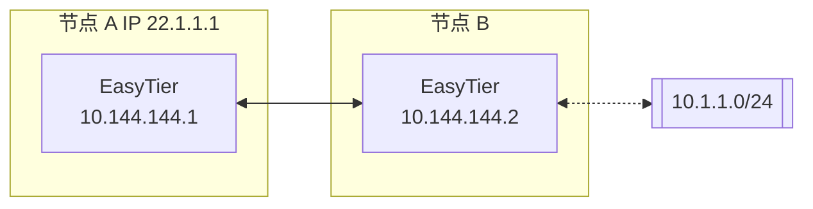

# 子网代理（点对网）

假设网络拓扑如下，节点 B 想将其可访问的子网 10.1.1.0/24 共享给其他节点。



则节点 B 的 easytier 启动参数为（新增 -n 参数）

```sh
sudo easytier-core --ipv4 10.144.144.2 -n 10.1.1.0/24
```

子网代理信息会自动同步到虚拟网络的每个节点，各个节点会自动配置相应的路由，节点 A 可以通过如下命令检查子网代理是否生效。

1. 检查路由信息是否已经同步，proxy_cidrs 列展示了被代理的子网。

   ```sh
   easytier-cli route
   ```
   

2. 测试节点 A 是否可访问被代理子网下的节点

   ```sh
   ping 10.1.1.2
   ```

---