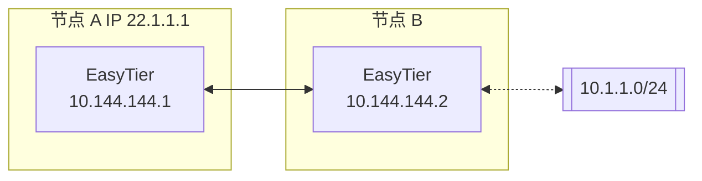

# 子网代理（点对网）

假设网络拓扑如下，节点 B 想将其可访问的子网 10.1.1.0/24 共享给其他节点。



则节点 B 的 easytier 启动参数为（新增 -n 参数）

```sh
sudo easytier-core --ipv4 10.144.144.2 -n 10.1.1.0/24
```

子网代理信息会自动同步到虚拟网络的每个节点，各个节点会自动配置相应的路由，节点 A 可以通过如下命令检查子网代理是否生效。

1. 检查路由信息是否已经同步，proxy_cidrs 列展示了被代理的子网。

   ```sh
   easytier-cli route
   ```

   | ipv4         | hostname | proxy_cidrs | next_hop_ipv4 | next_hop_hostname | next_hop_lat | cost |
   | :----------- | :------- | :---------- | :------------ | :---------------- | :----------- | :--- |
   | 10.144.144.1 | abc-dec  | 10.1.1.0/24 | DIRECT        |                   | 3.25         | 1    |

2. 测试节点 A 是否可访问被代理子网下的节点

   ```sh
   ping 10.1.1.2
   ```

::: warning 提示
子网代理的 -n 参数可以多次指定，以代理多个子网；也可以将掩码设置为 32 以代理单个 IP 地址。

```sh
easytier-core -n 10.1.1.0/24 -n 10.2.0.0/16 -n 10.3.3.3/32
```

:::

## 手工指定路由

默认情况下，当虚拟网中的某个节点配置了子网代理后，子网代理的网段会被同步到虚拟网内的所有节点上，并自动生成一条路由，将发往这些网段的数据包交由虚拟网处理。

这在大部分情况下可以简化组网，但在有些场景下，用户可能并不希望 EasyTier 在节点上自动配置路由，用户可通过 `--manual-routes` 参数手工配置需要转发到虚拟网的流量。

使用 `--manual-routes` 后，只有该参数配置的网段才会进入虚拟网，如果该参数后的列表为空，则 EasyTier 不会处理任何非虚拟网网段的流量。

## 防火墙

由于代理流量需要用到系统的网络栈，因此子网代理需要关闭在虚拟网卡上的防火墙（Linux 和 Windows 皆是如此）。

如果无法关闭防火墙，可以尝试用用户态的网络栈做子网代理，可以免去配置防火墙的步骤。只需要在启动 EasyTier 时添加 `--use-smoltcp` 参数即可。

::: warning 提示

用户态协议栈在性能、拥塞控制等方面会劣于内核协议栈。

目前 `--use-smoltcp` 参数仅影响 TCP 协议，UDP 和 ICMP 无论是否使用该参数都会使用用户态协议栈。

:::

## 禁用内置NAT

默认情况下，子网代理中启用了内置 NAT，在用户态处理数据包转发，使非网关设备也能成为子网入口，同时规避了不同操作系统上对于数据包转发的限制。

如果 Easytier 工作在网关设备上，用户可通过 `--proxy-forward-by-system` 参数将子网代理数据包交由系统内核转发，此时内置 NAT 关闭。

需要注意当该选项启用后，子网代理的数据包转发将完全依赖于操作系统，请确认操作系统的防火墙、转发规则、路由规则等配置正确。

---
