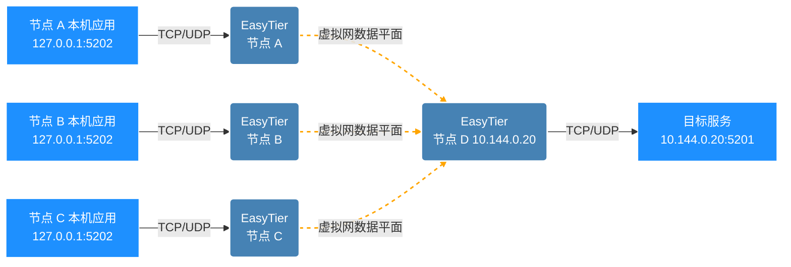

# 端口转发（Port Forward）

EasyTier 提供端口转发功能，可将宿主机上的 TCP/UDP 套接字"暴露"到 EasyTier 的虚拟网（overlay），或将宿主端口流量转发到虚拟网内的目标地址（dst）。

典型使用场景：

- 在本地监听一个端口，让虚拟网内的其他节点可通过该端口访问到本地服务。
- 在虚拟网内某节点上启动 EasyTier 并监听端口，将流量转发到虚拟网内另一节点的服务，无需在该目标节点额外配置。
- 在无 TUN 模式或受限环境下，通过端口转发替代 TUN 接入虚拟网。

支持的协议：`tcp` 和 `udp`。每条规则由「bind 地址（宿主）」「dst 地址（虚拟网 IPv4）」「协议」三部分组成。

## 网络拓扑

假设网络拓扑如下，多个节点（A、B、C）希望通过本机端口 `5202` 访问虚拟网内节点 D 的 `5201` 服务。每个节点各自配置端口转发规则，将本机 `127.0.0.1:5202` 流量转发到虚拟网内 `10.144.0.20:5201`。



## 使用端口转发

端口转发通过 `--port-forward` 参数配置，参数格式为：

```
<proto>://<bind_addr>/<dst_addr>
```

- `proto`：协议，可选 `tcp` 或 `udp`。
- `bind_addr`：宿主上的监听地址，例如 `127.0.0.1:5202` 或 `0.0.0.0:5202`。
- `dst_addr`：虚拟网内目标地址，必须是 IPv4 字面地址，例如 `10.144.0.20:5201`。

`--port-forward` 可以多次指定，配置多条转发规则。

### TCP 端口转发

将本机 `127.0.0.1:5202` 端口转发到虚拟网内 `10.144.0.20:5201`：

```sh
sudo easytier-core --port-forward tcp://127.0.0.1:5202/10.144.0.20:5201
```

启动后，本机或其他可访问该 bind 地址的程序即可通过 `127.0.0.1:5202` 访问虚拟网内的 `10.144.0.20:5201` 服务。

### UDP 端口转发

将本机 `127.0.0.1:5202` 端口转发到虚拟网内 `10.144.0.20:5201`：

```sh
sudo easytier-core --port-forward udp://127.0.0.1:5202/10.144.0.20:5201
```

### 同时配置多条规则

可在启动时通过多次指定 `--port-forward` 配置多条规则，例如同时暴露 TCP 和 UDP 服务：

```sh
sudo easytier-core \
  --port-forward tcp://127.0.0.1:5202/10.144.0.20:5201 \
  --port-forward udp://127.0.0.1:5202/10.144.0.20:5201
```

## 通过配置文件配置

除命令行参数外，端口转发规则也可写入配置文件，对应字段为 `port_forwards`，每条规则含 `bind_addr`、`dst_addr` 与 `proto` 三个字段：

```toml
[[port_forwards]]
proto = "tcp"
bind_addr = "127.0.0.1:5202"
dst_addr = "10.144.0.20:5201"

[[port_forwards]]
proto = "udp"
bind_addr = "127.0.0.1:5202"
dst_addr = "10.144.0.20:5201"
```

## 通过管理 RPC 动态修改

EasyTier 运行过程中可通过管理 RPC（`ConfigRpcService/PatchConfig`）动态添加或删除端口转发规则，无需重启实例。该方式常用于 iOS/FFI 或编程式集成场景，例如 iOS 通过 `easytier_ios_call_json_rpc` 调用 PatchConfig RPC 修改实例配置。

## 性能

EasyTier 的端口转发基于虚拟网数据平面实现，原生 UDP 转发在 1 Gbit/s 负载下可接近 999 Mbit/s；TCP 转发经数据平面与宿主-驱动循环优化后，单流吞吐可接近 1.17 Gbit/s。性能主要受数据平面与系统网络栈影响，建议优先使用内核网络栈以获得更高吞吐。

## 限制与注意事项

- **绑定冲突**：`(协议, bind 地址)` 组合必须唯一。若两条规则使用相同的 `(协议, bind 地址)` 但不同 `dst`，第一条绑定成功后，第二条在启动阶段会因端口/地址已被占用而失败。调用方需保证 `(协议, bind 地址)` 对唯一。
- **目标地址限定**：`dst_addr` 必须为虚拟网 IPv4 字面地址。若目标在 EasyTier 路由中不存在，会返回正常网络错误，不会回退到宿主网络。
- **UDP 大包乱序**：Core 缓冲允许最大 IPv4 UDP 有效负载 65507 字节，但在当前 MTU 与 smoltcp 限制下，极端乱序可能超过 smoltcp 能追踪的分片数（最多 16 段），导致极大包在高度乱序下丢包。
- **UDP 首包入站**：UDP 监听 socket 在发送给某个 peer 之后才会安装精确的 UDP 数据平面 flow；新绑定 socket 可能收不到来自未知 peer 的第一包，直到双方建立互返流。此行为不影响 TUN 平面或经 TUN 可达的 port-forward 目的地。
