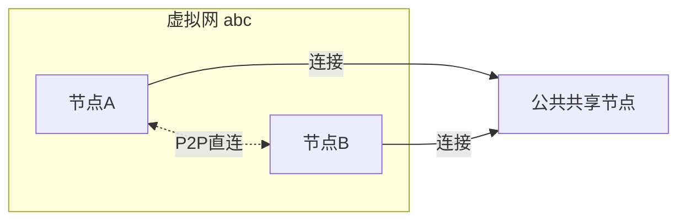
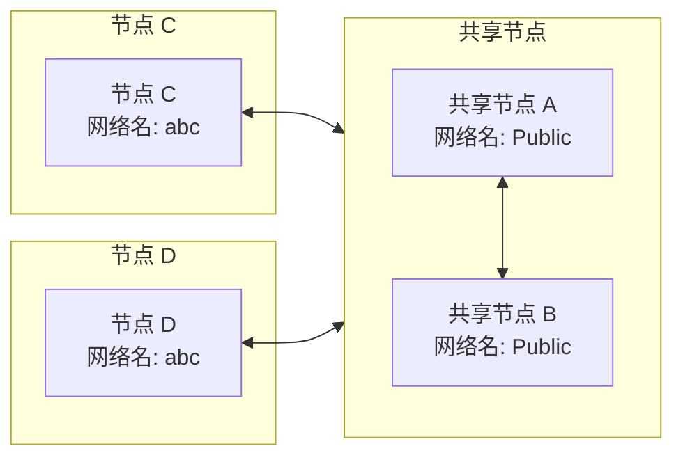
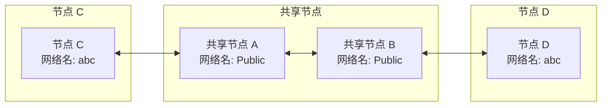

# 快速组网

## 利用共享节点组网

当没有公网 IP 时，可使用 EasyTier 社区提供的免费共享节点快速组网。节点间会自动尝试 NAT 穿透并建立 P2P 连接，P2P 失败时由共享节点中转数据。

通过以下步骤可以构建一个简单的双节点虚拟网络：



### 步骤示例

假设有两个节点 A 和 B：

#### 1. 在节点 A 上运行

::: code-group

```sh [Linux]
# 管理员权限运行
./easytier-core -d --network-name abc --network-secret abc -p tcp://public.easytier.cn:11010
```

```powershell [Windows]
# 管理员权限运行
.\easytier-core.exe -d --network-name abc --network-secret abc -p tcp://public.easytier.cn:11010
```

:::

- `-d` 自动分配虚拟 IP，默认分配 `10.126.126.0/24` 网段，可使用 `-i 10.11.11.0/24` 指定其他虚拟 IP。
- `--network-name` 指定虚拟网络名称（支持中文）。注意：若与其他用户网络名冲突，可能导致组网失败。
- `--network-secret` 指定虚拟网络的密码，用于保护网络安全。
- `-p` 指定节点地址，此处为官方共享节点，也可用[其他公共节点](https://easytier.gd.nkbpal.cn/status/easytier)

#### 2. 在节点 B 上运行

::: code-group

```sh [Linux]
# 管理员权限运行
./easytier-core -d --network-name abc --network-secret abc -p tcp://public.easytier.cn:11010
```

```powershell [Windows]
# 管理员权限运行
.\easytier-core.exe -d --network-name abc --network-secret abc -p tcp://public.easytier.cn:11010
```

:::

- `-d` 表示 DHCP 模式，自动分配虚拟 IP
- `-p` 需指定与节点 A 使用相同的共享节点

#### 3. 测试组网

在节点 B 上测试与节点 A 的连通性：

```sh
ping 10.126.126.1
ping 10.126.126.2
```

::: warning 注意
如无法 ping 通，可能是防火墙阻止入站流量。请关闭防火墙或添加放行规则。
:::

#### 4. 加入更多节点

可以继续在其他节点上运行相同命令，加入同一虚拟网络。

## 查看虚拟网络状态

EasyTier 启动后，可用 easytier-cli 管理和查看状态。

- 查看虚拟网中的节点信息：

```sh
easytier-cli peer
```

---

| ipv4         | hostname | cost | lat_ms | loss_rate | rx_bytes | tx_bytes | tunnel_proto | nat_type | id        |
| :----------- | :------- | :--- | :----- | :-------- | :------- | :------- | :----------- | :------- | :-------- |
| 10.144.144.1 | abc-dec  | 1    | 3.452  | 0         | 17.33kB  | 20.42kB  | udp          | FullCone | 390879727 |

- 查看虚拟网路由信息：

```sh
easytier-cli route
```

---

| ipv4         | hostname | proxy_cidrs | next_hop_ipv4 | next_hop_hostname | next_hop_lat | cost |
| :----------- | :------- | :---------- | :------------ | :---------------- | :----------- | :--- |
| 10.144.144.1 | abc-dec  |             | DIRECT        |                   | 3.646        | 1    |

- 查看本节点信息：

```sh
easytier-cli node
```

---

::: details 输出示例

```
┌───────────────┬──────────────────────┐
│ Virtual IP    │ 10.144.144.1         │
├───────────────┼──────────────────────┤
│ Hostname      │ archlinux-base       │
├───────────────┼──────────────────────┤
│ Proxy CIDRs   │ 10.147.223.0/24      │
├───────────────┼──────────────────────┤
│ Peer ID       │ 2616333191           │
├───────────────┼──────────────────────┤
│ Public IP     │ 75.52.125.26         │
├───────────────┼──────────────────────┤
│ UDP Stun Type │ FullCone             │
├───────────────┼──────────────────────┤
│ Listener 1    │ tcp://0.0.0.0:11010  │
├───────────────┼──────────────────────┤
│ Listener 2    │ udp://0.0.0.0:11010  │
├───────────────┼──────────────────────┤
│ Listener 3    │ wg://0.0.0.0:11011   │
├───────────────┼──────────────────────┤
│ Listener 4    │ ws://0.0.0.0:11011/  │
├───────────────┼──────────────────────┤
│ Listener 5    │ wss://0.0.0.0:11012/ │
├───────────────┼──────────────────────┤
│ Listener 6    │ udp://[::]:37039     │
└───────────────┴──────────────────────┘
```

:::

---

## 同时使用多个共享节点组网

为提升可用性，可同时连接多个共享节点，只需指定多个 `-p` 参数：

```sh
-p tcp://1.1.1.1:11010 -p udp://1.1.1.2:11011
```

建议所有节点指定相同的共享节点列表。

### 组网原理示意

下图展示了多个共享节点集群下的组网模式：



即使出现网络分区，C 只能连到 A，D 只能连到 B，C 和 D 依然可通信：



---

## 同时加入/组建多个虚拟网络

EasyTier 支持同一设备运行多个进程，每个进程加入不同虚拟网。注意：
- 不同虚拟网的虚拟 IP 网段不能重叠，否则路由冲突；
- 启动多个实例时需指定不同监听端口，否则端口冲突。

示例：

```sh
# 管理员权限运行
./easytier-core --network-name net1 -p tcp://public.easytier.cn:11010 -l 11010
./easytier-core --network-name net2 -p tcp://public.easytier.cn:11010 -l 21010
```

- `-l` 指定监听端口。

---

## 搭建共享节点

如果希望搭建自己的共享节点，可以参考 [搭建共享节点](host-public-server) 文档。
