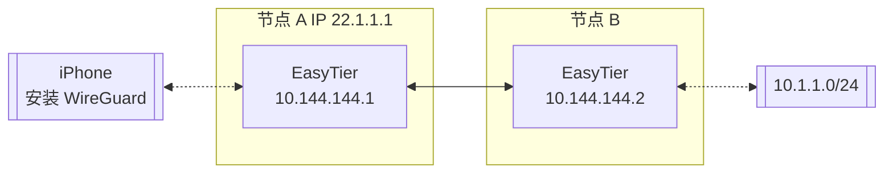

# 使用 WireGuard 客户端接入

EasyTier 可以用作 WireGuard 服务端，让任意安装了 WireGuard 客户端的设备访问 EasyTier 网络。对于目前 EasyTier 不支持的平台 （如 iOS、Android 等），可以使用这种方式接入 EasyTier 网络。

假设网络拓扑如下：



我们需要 iPhone 通过节点 A 访问 EasyTier 网络，则可进行如下配置：

在节点 A 的 easytier-core 命令中，加入 --vpn-portal 参数，指定 WireGuard 服务监听的端口，以及 WireGuard 网络使用的网段。

```sh
# 以下参数的含义为： 监听 0.0.0.0:11013 端口，WireGuard 使用 10.14.14.0/24 网段
sudo easytier-core --ipv4 10.144.144.1 --vpn-portal wg://0.0.0.0:11013/10.14.14.0/24
```

easytier-core 启动成功后，使用 easytier-cli 获取 WireGuard Client 的配置。

```sh
$> easytier-cli vpn-portal
portal_name: wireguard

client_config:
[Interface]
PrivateKey = 9VDvlaIC9XHUvRuE06hD2CEDrtGF+0lDthgr9SZfIho=
Address = 10.14.14.0/24 # should assign an ip from this cidr manually

[Peer]
PublicKey = zhrZQg4QdPZs8CajT3r4fmzcNsWpBL9ImQCUsnlXyGM=
AllowedIPs = 192.168.80.0/20,10.147.223.0/24,10.144.144.0/24
Endpoint = 0.0.0.0:11013 # should be the public ip of the vpn server

connected_clients:
[]

```

使用 Client Config 前，需要将 Interface Address 和 Peer Endpoint 分别修改为客户端的 IP 和 EasyTier 节点的 IP。将配置文件导入 WireGuard 客户端，即可访问 EasyTier 网络。

---
