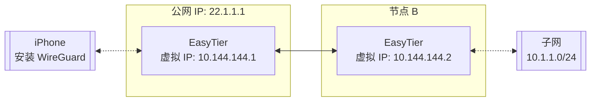

# 使用 WireGuard 客户端接入

EasyTier 可以用作 WireGuard 服务端，让任意安装了 WireGuard 客户端的设备访问 EasyTier 网络。对于目前 EasyTier 不支持的平台，可以使用这种方式接入 EasyTier 网络。

## 网络拓扑

假设网络拓扑如下，A 节点和 B 节点使用网 [双节点组网](decentralized-networking#two-nodes) 方式组网，并且 B 节点通过 [子网代理](point-to-networking) 代理了 `10.1.1.0/24` 子网。



我们需要 iPhone 通过节点 A 访问 EasyTier 网络，则可进行如下配置。

## 配置步骤

### 1. 配置节点 A

在节点 A 的 `easytier-core` 命令中，加入 `--vpn-portal` 参数，指定 WireGuard 服务监听的端口，以及 WireGuard 网络使用的网段。

```sh
# 以下参数的含义为：监听 0.0.0.0:11013 端口，WireGuard 使用 10.14.14.0/24 网段
sudo easytier-core --ipv4 10.144.144.1 --vpn-portal wg://0.0.0.0:11013/10.14.14.0/24
```

### 2. 获取 WireGuard 客户端配置

`easytier-core` 启动成功后，使用 `easytier-cli` 获取 WireGuard 客户端的配置。

```sh
$> easytier-cli vpn-portal
portal_name: wireguard

client_config:
[Interface]
PrivateKey = 9VDvlaIC9XHUvRuE06hD2CEDrtGF+0lDthgr9SZfIho=
Address = 10.14.14.0/24 # should assign an ip from this cidr manually

[Peer]
PublicKey = zhrZQg4QdPZs8CajT3r4fmzcNsWpBL9ImQCUsnlXyGM=
AllowedIPs = 192.168.80.0/20,10.147.223.0/24,10.144.144.0/24
Endpoint = 0.0.0.0:11013 # should be the public ip of the easytier server

connected_clients:
[]
```

## 使用客户端配置

使用 Client Config 前，需要将以下字段修改为实际值：

- **Interface Address**：修改为客户端的 IP，如 `10.14.14.1/24`，若接入多个 WireGuard 客户端，需确保每个客户端的 IP 不同。
- **Peer Endpoint**：修改为 EasyTier 节点 A 的公网 IP 和端口 `22.1.1.11:11013`。

将配置文件导入 WireGuard 客户端，即可访问 EasyTier 网络。

::: tip 提示
如果需要支持多个客户端，可以在 `easytier-core` 的 `--vpn-portal` 参数中指定更大的网段，例如 `10.14.0.0/16`。
:::

## 备注

WireGuard 客户端访问 EasyTier 虚拟网络的所有流量都会经过 EasyTier 节点 A，需要确保节点 A 的网络连接稳定，并且一般情况下需要 A 节点有公网 IP 才可以方便的使用。
